First, parse all the data as described last week: 

```r
library(tidyverse)
```

```
## Warning: package 'tidyverse' was built under R version 3.5.3
```

```
## Warning: package 'ggplot2' was built under R version 3.5.3
```

```
## Warning: package 'tibble' was built under R version 3.5.3
```

```
## Warning: package 'tidyr' was built under R version 3.5.3
```

```
## Warning: package 'readr' was built under R version 3.5.3
```

```
## Warning: package 'purrr' was built under R version 3.5.3
```

```
## Warning: package 'dplyr' was built under R version 3.5.3
```

```
## Warning: package 'stringr' was built under R version 3.5.3
```

```
## Warning: package 'forcats' was built under R version 3.5.3
```

```r
flowey <- read_csv("master_flowering_time_data_2020_05_01.csv")

head(flowey)
```

```
## # A tibble: 6 x 17
##   DNA_ID field_ID genotype group row   `end?` condition germ  yellow flowering
##   <chr>  <chr>    <chr>    <chr> <chr> <chr>  <chr>     <chr> <chr>  <chr>    
## 1 D132   SUN_A_01 WT       A     SUN_A end    sun       06_0~ 07_30~ 07_31_20~
## 2 D133   SUN_A_02 WT       A     SUN_A end    sun       06_0~ 07_30~ 08_01_20~
## 3 D134   SUN_A_03 WT       A     SUN_A middle sun       06_0~ 07_29~ 07_30_20~
## 4 D136   SUN_A_09 WT       A     SUN_A middle sun       06_0~ 07_30~ 08_01_20~
## 5 D137   SUN_A_10 WT       A     SUN_A middle sun       06_0~ 07_30~ 08_01_20~
## 6 D138   SUN_A_11 WT       A     SUN_A middle sun       06_0~ <NA>   07_25_20~
## # ... with 7 more variables: final <chr>, diameter <dbl>, direction <chr>,
## #   height <dbl>, leaf_num <dbl>, ax_heads <dbl>, notes <chr>
```

```r
ID <- flowey %>%
  select(field_ID) %>%
  separate(field_ID, sep = "_", into = c("bleh1", "bleh2", "row_ID"), convert = TRUE) %>%
  select(row_ID) 

flowey2 <- bind_cols(flowey, ID)
head(flowey2)
```

```
## # A tibble: 6 x 18
##   DNA_ID field_ID genotype group row   `end?` condition germ  yellow flowering
##   <chr>  <chr>    <chr>    <chr> <chr> <chr>  <chr>     <chr> <chr>  <chr>    
## 1 D132   SUN_A_01 WT       A     SUN_A end    sun       06_0~ 07_30~ 07_31_20~
## 2 D133   SUN_A_02 WT       A     SUN_A end    sun       06_0~ 07_30~ 08_01_20~
## 3 D134   SUN_A_03 WT       A     SUN_A middle sun       06_0~ 07_29~ 07_30_20~
## 4 D136   SUN_A_09 WT       A     SUN_A middle sun       06_0~ 07_30~ 08_01_20~
## 5 D137   SUN_A_10 WT       A     SUN_A middle sun       06_0~ 07_30~ 08_01_20~
## 6 D138   SUN_A_11 WT       A     SUN_A middle sun       06_0~ <NA>   07_25_20~
## # ... with 8 more variables: final <chr>, diameter <dbl>, direction <chr>,
## #   height <dbl>, leaf_num <dbl>, ax_heads <dbl>, notes <chr>, row_ID <int>
```

```r
#Fricken easy. 


flowey2$genotype <- parse_factor(flowey2$genotype)
flowey2$group <- parse_factor(flowey2$group)
flowey2$'end?' <- parse_factor(flowey2$'end?')
flowey2$condition <- parse_factor(flowey2$condition)
head(flowey2)
```

```
## # A tibble: 6 x 18
##   DNA_ID field_ID genotype group row   `end?` condition germ  yellow flowering
##   <chr>  <chr>    <fct>    <fct> <chr> <fct>  <fct>     <chr> <chr>  <chr>    
## 1 D132   SUN_A_01 WT       A     SUN_A end    sun       06_0~ 07_30~ 07_31_20~
## 2 D133   SUN_A_02 WT       A     SUN_A end    sun       06_0~ 07_30~ 08_01_20~
## 3 D134   SUN_A_03 WT       A     SUN_A middle sun       06_0~ 07_29~ 07_30_20~
## 4 D136   SUN_A_09 WT       A     SUN_A middle sun       06_0~ 07_30~ 08_01_20~
## 5 D137   SUN_A_10 WT       A     SUN_A middle sun       06_0~ 07_30~ 08_01_20~
## 6 D138   SUN_A_11 WT       A     SUN_A middle sun       06_0~ <NA>   07_25_20~
## # ... with 8 more variables: final <chr>, diameter <dbl>, direction <chr>,
## #   height <dbl>, leaf_num <dbl>, ax_heads <dbl>, notes <chr>, row_ID <int>
```

```r
#flowey2$germ <- parse_date(flowey2$germ, format = "%m_%d_%Y")
#problems(flowey2$germ)
flowey2$yellow <- parse_date(flowey2$yellow, format = "%m_%d_%Y") 
problems(flowey2$yellow)
```

```
## [1] row      col      expected actual  
## <0 rows> (or 0-length row.names)
```

```r
flowey2$flowering <- parse_date(flowey2$flowering, format = "%m_%d_%Y") 
problems(flowey2$flowering)
```

```
## [1] row      col      expected actual  
## <0 rows> (or 0-length row.names)
```

```r
flowey2$final <- parse_date(flowey2$final, format = "%m_%d_%Y") 
problems(flowey2$final)
```

```
## [1] row      col      expected actual  
## <0 rows> (or 0-length row.names)
```

```r
#first, make our final data frame with all the correct date-time values: 
flowey_3 <- flowey2 %>%
  filter(germ != "07_2019_03" | is.na(germ)) %>%
  filter(germ != "07_2019_04" | is.na(germ))

#next, make a date frame with the bad values: 
flowey_bad <- flowey2 %>%
  filter(germ == "07_2019_03" | germ == "07_2019_04") 

#next, parse `germ` correctly: 
flowey_3$germ <- parse_date(flowey_3$germ, format = "%m_%d_%Y")
flowey_bad$germ <- parse_date(flowey_bad$germ, format = "%m_%Y_%d")

head(flowey_bad)
```

```
## # A tibble: 0 x 18
## # ... with 18 variables: DNA_ID <chr>, field_ID <chr>, genotype <fct>,
## #   group <fct>, row <chr>, `end?` <fct>, condition <fct>, germ <date>,
## #   yellow <date>, flowering <date>, final <date>, diameter <dbl>,
## #   direction <chr>, height <dbl>, leaf_num <dbl>, ax_heads <dbl>, notes <chr>,
## #   row_ID <int>
```

```r
head(flowey_3)
```

```
## # A tibble: 6 x 18
##   DNA_ID field_ID genotype group row   `end?` condition germ       yellow    
##   <chr>  <chr>    <fct>    <fct> <chr> <fct>  <fct>     <date>     <date>    
## 1 D132   SUN_A_01 WT       A     SUN_A end    sun       2019-06-07 2019-07-30
## 2 D133   SUN_A_02 WT       A     SUN_A end    sun       2019-06-08 2019-07-30
## 3 D134   SUN_A_03 WT       A     SUN_A middle sun       2019-06-08 2019-07-29
## 4 D136   SUN_A_09 WT       A     SUN_A middle sun       2019-06-08 2019-07-30
## 5 D137   SUN_A_10 WT       A     SUN_A middle sun       2019-06-08 2019-07-30
## 6 D138   SUN_A_11 WT       A     SUN_A middle sun       2019-06-08 NA        
## # ... with 9 more variables: flowering <date>, final <date>, diameter <dbl>,
## #   direction <chr>, height <dbl>, leaf_num <dbl>, ax_heads <dbl>, notes <chr>,
## #   row_ID <int>
```

```r
#finally, stick the correct columns back into the final data frame and check: 
flowey_4 <- bind_rows(flowey_3, flowey_bad)
head(flowey_4)
```

```
## # A tibble: 6 x 18
##   DNA_ID field_ID genotype group row   `end?` condition germ       yellow    
##   <chr>  <chr>    <fct>    <fct> <chr> <fct>  <fct>     <date>     <date>    
## 1 D132   SUN_A_01 WT       A     SUN_A end    sun       2019-06-07 2019-07-30
## 2 D133   SUN_A_02 WT       A     SUN_A end    sun       2019-06-08 2019-07-30
## 3 D134   SUN_A_03 WT       A     SUN_A middle sun       2019-06-08 2019-07-29
## 4 D136   SUN_A_09 WT       A     SUN_A middle sun       2019-06-08 2019-07-30
## 5 D137   SUN_A_10 WT       A     SUN_A middle sun       2019-06-08 2019-07-30
## 6 D138   SUN_A_11 WT       A     SUN_A middle sun       2019-06-08 NA        
## # ... with 9 more variables: flowering <date>, final <date>, diameter <dbl>,
## #   direction <chr>, height <dbl>, leaf_num <dbl>, ax_heads <dbl>, notes <chr>,
## #   row_ID <int>
```

```r
flowey_final <-  flowey_4 %>%
  mutate(flowering_time = difftime(flowering, germ)) 

flowey_final <- flowey_final[, c(1, 2, 3, 4, 5, 18, 6, 7, 8, 9, 10, 19, 11, 12, 13, 14, 15, 16, 17)] #reorder columns nicely. 
head(flowey_final)
```

```
## # A tibble: 6 x 19
##   DNA_ID field_ID genotype group row   row_ID `end?` condition germ      
##   <chr>  <chr>    <fct>    <fct> <chr>  <int> <fct>  <fct>     <date>    
## 1 D132   SUN_A_01 WT       A     SUN_A      1 end    sun       2019-06-07
## 2 D133   SUN_A_02 WT       A     SUN_A      2 end    sun       2019-06-08
## 3 D134   SUN_A_03 WT       A     SUN_A      3 middle sun       2019-06-08
## 4 D136   SUN_A_09 WT       A     SUN_A      9 middle sun       2019-06-08
## 5 D137   SUN_A_10 WT       A     SUN_A     10 middle sun       2019-06-08
## 6 D138   SUN_A_11 WT       A     SUN_A     11 middle sun       2019-06-08
## # ... with 10 more variables: yellow <date>, flowering <date>,
## #   flowering_time <drtn>, final <date>, diameter <dbl>, direction <chr>,
## #   height <dbl>, leaf_num <dbl>, ax_heads <dbl>, notes <chr>
```

### Question 1

Flowering time (between `germ` and `flowering`) already calculated. 
Calculate additional variables: 

```r
#flowering duration: days between `flowering` and `final`
#flowering rate: `diameter`/`flowering_duration`
#leaf frequency: `should be `leaf_num`/`height
data_vars <- flowey_final %>%
  mutate(
    flowering_duration = difftime(final, flowering, units = "days"), 
    leaf_frequency = leaf_num/height)

data_vars$flowering_time <- as.integer(data_vars$flowering_time)
data_vars$flowering_duration = as.integer(data_vars$flowering_duration)

data <- data_vars %>%
  mutate(flowering_rate = diameter/flowering_duration) %>%
  filter(genotype == "WT" | genotype == "elf3")

data$geno_cond <- paste(data$genotype, data$condition, sep = ", ")

data <- data[, c(1, 2, 3, 4, 5, 6, 7, 8, 9, 10, 11, 13, 14, 15, 16, 17, 18, 19, 12, 20, 21, 22, 23)]

head(data)
```

```
## # A tibble: 6 x 23
##   DNA_ID field_ID genotype group row   row_ID `end?` condition germ      
##   <chr>  <chr>    <fct>    <fct> <chr>  <int> <fct>  <fct>     <date>    
## 1 D132   SUN_A_01 WT       A     SUN_A      1 end    sun       2019-06-07
## 2 D133   SUN_A_02 WT       A     SUN_A      2 end    sun       2019-06-08
## 3 D134   SUN_A_03 WT       A     SUN_A      3 middle sun       2019-06-08
## 4 D136   SUN_A_09 WT       A     SUN_A      9 middle sun       2019-06-08
## 5 D137   SUN_A_10 WT       A     SUN_A     10 middle sun       2019-06-08
## 6 D138   SUN_A_11 WT       A     SUN_A     11 middle sun       2019-06-08
## # ... with 14 more variables: yellow <date>, flowering <date>, final <date>,
## #   diameter <dbl>, direction <chr>, height <dbl>, leaf_num <dbl>,
## #   ax_heads <dbl>, notes <chr>, flowering_time <int>,
## #   flowering_duration <int>, leaf_frequency <dbl>, flowering_rate <dbl>,
## #   geno_cond <chr>
```


###Question 2

#### Flowering Time Plots

Make a plot of flowering time for all plants; separate by condition and genotype 


```r
data$geno_cond <- factor(data$geno_cond, levels = c("WT, sun", "elf3, sun", "WT, shade", "elf3, shade"))

ggplot(data, aes(geno_cond, flowering_time, fill = geno_cond)) + 
  geom_boxplot() + 
  labs(title = "Flowering time (days between germination date and\nflowering date) for WT and elf3 sunflowers in sun and shade", 
       x = "genotype", y = "flowering time (days)", fill = "Genotype, condition") +
  scale_fill_manual(values = c("#56B4E9","#D55E00", "#0072B2", "#009E73")) + 
  coord_cartesian(ylim = c(45, 67.5)) + 
  scale_y_continuous(breaks = seq(from = 45, to = 70, by = 2.5), minor_breaks = seq(from = 45, to = 70, by = 2.5)) + 
  scale_x_discrete(labels = c("WT", "elf3", "WT", "elf3")) +
  geom_vline(xintercept = 2.5, linetype = "dashed") + 
  geom_text(aes(x = 1.8, y = 67), label = "sun", size = 6.5) + 
  geom_text(aes(x = 3.2, y = 67), label = "shade", size = 6.5) +
  theme_bw() +
  theme(panel.grid.major.x = element_blank(), plot.title = element_text(hjust = 0.5), 
        axis.title.x = element_text(size = 16), 
        axis.title.y = element_text(size = 14), 
        axis.text.x = element_text(size = 14)) 
```

```
## Warning: Removed 16 rows containing non-finite values (stat_boxplot).
```

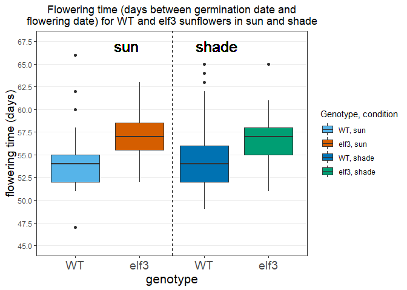<!-- -->

*Legend redundant in this case?*

Anyway, let's plot the same thing, but for individual planting groups. 

```r
data %>%
  filter(group == "A") %>%
  ggplot(aes(geno_cond, flowering_time, fill = geno_cond)) + 
  geom_boxplot() + 
  labs(title = "Flowering time (days between germination date andflowering date)\nfor WT and elf3 sunflowers in sun and shade, Group A", 
       x = "genotype", y = "flowering time (days)", fill = "Genotype, condition") +
  scale_fill_manual(values = c("#56B4E9","#D55E00", "#0072B2", "#009E73")) + 
  coord_cartesian(ylim = c(45, 67.5)) + 
  scale_y_continuous(breaks = seq(from = 45, to = 70, by = 2.5), minor_breaks = seq(from = 45, to = 70, by = 2.5)) + 
  scale_x_discrete(labels = c("WT", "elf3", "WT", "elf3")) +
  geom_vline(xintercept = 2.5, linetype = "dashed") + 
  geom_text(aes(x = 1.8, y = 67), label = "sun", size = 6.5) + 
  geom_text(aes(x = 3.2, y = 67), label = "shade", size = 6.5) +
  theme_bw() +
  theme(panel.grid.major.x = element_blank(), plot.title = element_text(hjust = 0.5), 
        axis.title.x = element_text(size = 16), 
        axis.title.y = element_text(size = 14), 
        axis.text.x = element_text(size = 14)) 
```

```
## Warning: Removed 3 rows containing non-finite values (stat_boxplot).
```

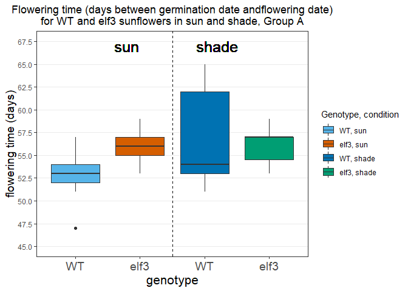<!-- -->

```r
data %>%
  filter(group == "B") %>%
  ggplot(aes(geno_cond, flowering_time, fill = geno_cond)) + 
  geom_boxplot() + 
  labs(title = "Flowering time (days between germination date andflowering date)\nfor WT and elf3 sunflowers in sun and shade, Group B", 
       x = "genotype", y = "flowering time (days)", fill = "Genotype, condition") +
  scale_fill_manual(values = c("#56B4E9","#D55E00", "#0072B2", "#009E73")) + 
  coord_cartesian(ylim = c(45, 67.5)) + 
  scale_y_continuous(breaks = seq(from = 45, to = 70, by = 2.5), minor_breaks = seq(from = 45, to = 70, by = 2.5)) + 
  scale_x_discrete(labels = c("WT", "elf3", "WT", "elf3")) +
  geom_vline(xintercept = 2.5, linetype = "dashed") + 
  geom_text(aes(x = 1.8, y = 67), label = "sun", size = 6.5) + 
  geom_text(aes(x = 3.2, y = 67), label = "shade", size = 6.5) +
  theme_bw() +
  theme(panel.grid.major.x = element_blank(), plot.title = element_text(hjust = 0.5), 
        axis.title.x = element_text(size = 16), 
        axis.title.y = element_text(size = 14), 
        axis.text.x = element_text(size = 14)) 
```

```
## Warning: Removed 6 rows containing non-finite values (stat_boxplot).
```

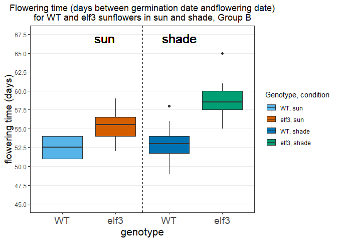<!-- -->

```r
data %>%
  filter(group == "C") %>%
  ggplot(aes(geno_cond, flowering_time, fill = geno_cond)) + 
  geom_boxplot() + 
  labs(title = "Flowering time (days between germination date andflowering date)\nfor WT and elf3 sunflowers in sun and shade, Group C", 
       x = "genotype", y = "flowering time (days)", fill = "Genotype, condition") +
  scale_fill_manual(values = c("#56B4E9","#D55E00", "#0072B2", "#009E73")) + 
  coord_cartesian(ylim = c(45, 67.5)) + 
  scale_y_continuous(breaks = seq(from = 45, to = 70, by = 2.5), minor_breaks = seq(from = 45, to = 70, by = 2.5)) + 
  scale_x_discrete(labels = c("WT", "elf3", "WT", "elf3")) +
  geom_vline(xintercept = 2.5, linetype = "dashed") + 
  geom_text(aes(x = 1.8, y = 67), label = "sun", size = 6.5) + 
  geom_text(aes(x = 3.2, y = 67), label = "shade", size = 6.5) +
  theme_bw() +
  theme(panel.grid.major.x = element_blank(), plot.title = element_text(hjust = 0.5), 
        axis.title.x = element_text(size = 16), 
        axis.title.y = element_text(size = 14), 
        axis.text.x = element_text(size = 14)) 
```

```
## Warning: Removed 7 rows containing non-finite values (stat_boxplot).
```

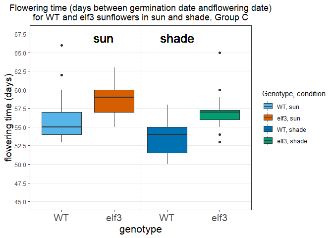<!-- -->

```r
data %>%
  filter(group == "D") %>%
  ggplot(aes(geno_cond, flowering_time, fill = geno_cond)) + 
  geom_boxplot() + 
  labs(title = "Flowering time (days between germination date andflowering date)\nfor WT and elf3 sunflowers in sun and shade, Group D", 
       x = "genotype", y = "flowering time (days)", fill = "Genotype, condition") +
  scale_fill_manual(values = c("#56B4E9","#D55E00", "#0072B2", "#009E73")) + 
  coord_cartesian(ylim = c(45, 67.5)) + 
  scale_y_continuous(breaks = seq(from = 45, to = 70, by = 2.5), minor_breaks = seq(from = 45, to = 70, by = 2.5)) + 
  scale_x_discrete(labels = c("WT", "elf3", "WT", "elf3")) +
  geom_vline(xintercept = 2.5, linetype = "dashed") + 
  geom_text(aes(x = 1.8, y = 67), label = "sun", size = 6.5) + 
  geom_text(aes(x = 3.2, y = 67), label = "shade", size = 6.5) +
  theme_bw() +
  theme(panel.grid.major.x = element_blank(), plot.title = element_text(hjust = 0.5), 
        axis.title.x = element_text(size = 16), 
        axis.title.y = element_text(size = 14), 
        axis.text.x = element_text(size = 14)) 
```

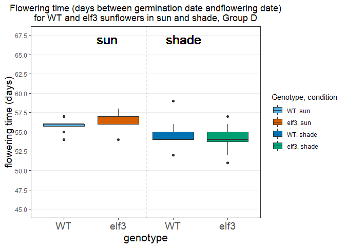<!-- -->

Looking at the data, we can see that sun/shade conditions seem to have no effect on the flowering time in days (i.e. same-genotype flowering time is the same whether in sun or in shade). WT plants have shorter flowering times in days than elf3 plants. 

#### Flowering Duration Plots

First, graph flowering duration for all groups:


```r
summary(data$flowering_duration)
```

```
##    Min. 1st Qu.  Median    Mean 3rd Qu.    Max.    NA's 
##   0.000   6.000   7.000   6.209   7.000   9.000      28
```

```r
library(Rmisc)
```

```
## Warning: package 'Rmisc' was built under R version 3.5.3
```

```
## Loading required package: lattice
```

```
## Loading required package: plyr
```

```
## ------------------------------------------------------------------------------
```

```
## You have loaded plyr after dplyr - this is likely to cause problems.
## If you need functions from both plyr and dplyr, please load plyr first, then dplyr:
## library(plyr); library(dplyr)
```

```
## ------------------------------------------------------------------------------
```

```
## 
## Attaching package: 'plyr'
```

```
## The following objects are masked from 'package:dplyr':
## 
##     arrange, count, desc, failwith, id, mutate, rename, summarise,
##     summarize
```

```
## The following object is masked from 'package:purrr':
## 
##     compact
```

```r
library(tidyverse)

average_flowering_duration <- data %>% 
  filter(flowering_duration != 0, flowering_duration != is.na(flowering_duration)) %>%
  summarySE(measurevar = "flowering_duration", groupvars = "geno_cond")

average_flowering_duration_A <- data %>% 
  filter(flowering_duration != 0, flowering_duration != is.na(flowering_duration), group == "A") %>%
  summarySE(measurevar = "flowering_duration", groupvars = "geno_cond")

average_flowering_duration_B <- data %>% 
  filter(flowering_duration != 0, flowering_duration != is.na(flowering_duration), group == "B") %>%
  summarySE(measurevar = "flowering_duration", groupvars = "geno_cond")

average_flowering_duration_C <- data %>% 
  filter(flowering_duration != 0, flowering_duration != is.na(flowering_duration), group == "C") %>%
  summarySE(measurevar = "flowering_duration", groupvars = "geno_cond")

average_flowering_duration_D <- data %>% 
  filter(flowering_duration != 0, flowering_duration != is.na(flowering_duration), group == "D") %>%
  summarySE(measurevar = "flowering_duration", groupvars = "geno_cond")

average_flowering_duration 
```

```
##     geno_cond  N flowering_duration        sd        se        ci
## 1     WT, sun 67           6.432836 1.1706497 0.1430176 0.2855439
## 2   elf3, sun 56           6.303571 1.0430662 0.1393856 0.2793349
## 3   WT, shade 61           6.721311 0.7985643 0.1022457 0.2045218
## 4 elf3, shade 59           6.491525 0.9715413 0.1264839 0.2531850
```

```r
average_flowering_duration_C
```

```
##     geno_cond  N flowering_duration        sd        se        ci
## 1     WT, sun 20           5.950000 1.2343760 0.2760149 0.5777058
## 2   elf3, sun 21           6.000000 0.8944272 0.1951800 0.4071384
## 3   WT, shade 23           6.695652 0.7029019 0.1465652 0.3039576
## 4 elf3, shade 23           6.565217 0.9451352 0.1970743 0.4087071
```
Looks good. Now, plot!


```r
  ggplot(average_flowering_duration, aes(geno_cond, flowering_duration, color = geno_cond)) +
  geom_point(size = 4) + 
  labs(title = "Mean flowering duration (days between flowering date and\nfinal date) for WT and elf3 sunflowers in sun and shade", 
       x = "genotype", y = "flowering duration (days)", color = "Genotype, condition") +
  scale_fill_manual(values = c("#56B4E9","#D55E00", "#0072B2", "#009E73")) + 
  coord_cartesian(ylim = c(5, 8)) + 
  scale_y_continuous(breaks = seq(from = 4.6, to = 8.2, by = 0.2), minor_breaks = seq(from = 4.6, to = 8.2, by = 0.2)) + 
  scale_x_discrete(labels = c("WT", "elf3", "WT", "elf3")) +
  geom_vline(xintercept = 2.5, linetype = "dashed") + 
  geom_errorbar(aes(ymin = flowering_duration - sd, ymax = flowering_duration + sd), width = 0.2, size = 1.5) +
  geom_text(aes(x = 1.8, y = 7.8), label = "sun", size = 6.5, color = "black") + 
  geom_text(aes(x = 3.2, y = 7.8), label = "shade", size = 6.5, color = "black") +
  theme_bw() +
  theme(panel.grid.major.x = element_blank(), plot.title = element_text(hjust = 0.5), 
        axis.title.x = element_text(size = 16), 
        axis.title.y = element_text(size = 14), 
        axis.text.x = element_text(size = 14)) 
```

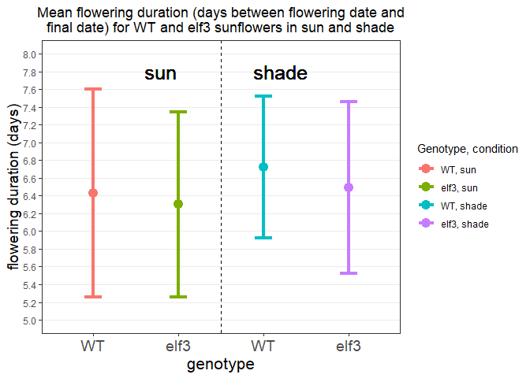<!-- -->

By group:

```r
  ggplot(average_flowering_duration_A, aes(geno_cond, flowering_duration, color = geno_cond)) +
  geom_point(size = 4) + 
  labs(title = "Mean flowering duration (days between flowering date and\nfinal date) for WT and elf3 sunflowers in sun and shade, Group A", 
       x = "genotype", y = "flowering duration (days)", color = "Genotype, condition") +
  scale_fill_manual(values = c("#56B4E9","#D55E00", "#0072B2", "#009E73")) + 
  coord_cartesian(ylim = c(5.4, 8)) + 
  scale_y_continuous(breaks = seq(from = 4.6, to = 8.2, by = 0.2), minor_breaks = seq(from = 4.6, to = 8.2, by = 0.2)) + 
  scale_x_discrete(labels = c("WT", "elf3", "WT", "elf3")) +
  geom_vline(xintercept = 2.5, linetype = "dashed") + 
  geom_errorbar(aes(ymin = flowering_duration - sd, ymax = flowering_duration + sd), width = 0.2, size = 1.5) +
  geom_text(aes(x = 1.8, y = 7.95), label = "sun", size = 6.5, color = "black") + 
  geom_text(aes(x = 3.2, y = 7.95), label = "shade", size = 6.5, color = "black") +
  theme_bw() +
  theme(panel.grid.major.x = element_blank(), plot.title = element_text(hjust = 0.5), 
        axis.title.x = element_text(size = 16), 
        axis.title.y = element_text(size = 14), 
        axis.text.x = element_text(size = 14)) 
```

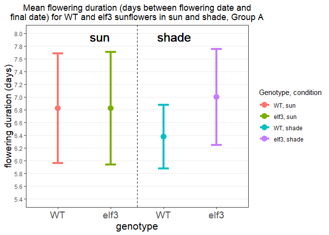<!-- -->

```r
  ggplot(average_flowering_duration_B, aes(geno_cond, flowering_duration, color = geno_cond)) +
  geom_point(size = 4) + 
  labs(title = "Mean flowering duration (days between flowering date and\nfinal date) for WT and elf3 sunflowers in sun and shade, Group B", 
       x = "genotype", y = "flowering duration (days)", color = "Genotype, condition") +
  scale_fill_manual(values = c("#56B4E9","#D55E00", "#0072B2", "#009E73")) + 
  coord_cartesian(ylim = c(5, 8.6)) + 
  scale_y_continuous(breaks = seq(from = 4.6, to = 9, by = 0.2), minor_breaks = seq(from = 4.6, to = 9, by = 0.2)) + 
  scale_x_discrete(labels = c("WT", "elf3", "WT", "elf3")) +
  geom_vline(xintercept = 2.5, linetype = "dashed") + 
  geom_errorbar(aes(ymin = flowering_duration - sd, ymax = flowering_duration + sd), width = 0.2, size = 1.5) +
  geom_text(aes(x = 1.8, y = 8.45), label = "sun", size = 6.5, color = "black") + 
  geom_text(aes(x = 3.2, y = 8.45), label = "shade", size = 6.5, color = "black") +
  theme_bw() +
  theme(panel.grid.major.x = element_blank(), plot.title = element_text(hjust = 0.5), 
        axis.title.x = element_text(size = 16), 
        axis.title.y = element_text(size = 14), 
        axis.text.x = element_text(size = 14)) 
```

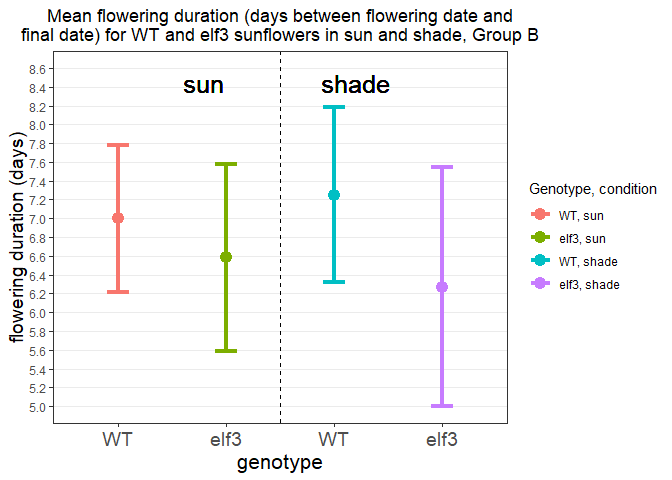<!-- -->

```r
    ggplot(average_flowering_duration_C, aes(geno_cond, flowering_duration, color = geno_cond)) +
  geom_point(size = 4) + 
  labs(title = "Mean flowering duration (days between flowering date and\nfinal date) for WT and elf3 sunflowers in sun and shade, Group C", 
       x = "genotype", y = "flowering duration (days)", color = "Genotype, condition") +
  scale_fill_manual(values = c("#56B4E9","#D55E00", "#0072B2", "#009E73")) + 
  coord_cartesian(ylim = c(4.2, 8)) + 
  scale_y_continuous(breaks = seq(from = 3, to = 8.2, by = 0.2), minor_breaks = seq(from = 3, to = 8.2, by = 0.2)) + 
  scale_x_discrete(labels = c("WT", "elf3", "WT", "elf3")) +
  geom_vline(xintercept = 2.5, linetype = "dashed") + 
  geom_errorbar(aes(ymin = flowering_duration - sd, ymax = flowering_duration + sd), width = 0.2, size = 1.5) +
  geom_text(aes(x = 1.8, y = 7.8), label = "sun", size = 6.5, color = "black") + 
  geom_text(aes(x = 3.2, y = 7.8), label = "shade", size = 6.5, color = "black") +
  theme_bw() +
  theme(panel.grid.major.x = element_blank(), plot.title = element_text(hjust = 0.5), 
        axis.title.x = element_text(size = 16), 
        axis.title.y = element_text(size = 14), 
        axis.text.x = element_text(size = 14)) 
```

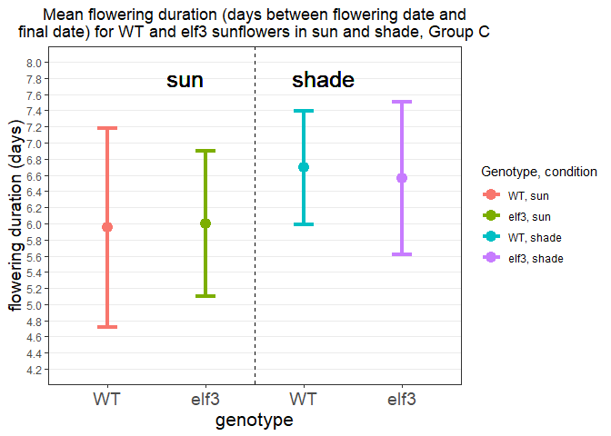<!-- -->

```r
      ggplot(average_flowering_duration_D, aes(geno_cond, flowering_duration, color = geno_cond)) +
  geom_point(size = 4) + 
  labs(title = "Mean flowering duration (days between flowering date and\nfinal date) for WT and elf3 sunflowers in sun and shade", 
       x = "genotype", y = "flowering duration (days)", color = "Genotype, condition") +
  scale_fill_manual(values = c("#56B4E9","#D55E00", "#0072B2", "#009E73")) + 
  coord_cartesian(ylim = c(3, 7.8)) + 
  scale_y_continuous(breaks = seq(from = 1, to = 8.2, by = 0.2), minor_breaks = seq(from = 1, to = 8.2, by = 0.2)) + 
  scale_x_discrete(labels = c("WT", "elf3", "WT", "elf3")) +
  geom_vline(xintercept = 2.5, linetype = "dashed") + 
  geom_errorbar(aes(ymin = flowering_duration - sd, ymax = flowering_duration + sd), width = 0.2, size = 1.5) +
  geom_text(aes(x = 1.8, y = 7.6), label = "sun", size = 6.5, color = "black") + 
  geom_text(aes(x = 3.2, y = 7.6), label = "shade", size = 6.5, color = "black") +
  theme_bw() +
  theme(panel.grid.major.x = element_blank(), plot.title = element_text(hjust = 0.5), 
        axis.title.x = element_text(size = 16), 
        axis.title.y = element_text(size = 14), 
        axis.text.x = element_text(size = 14)) 
```

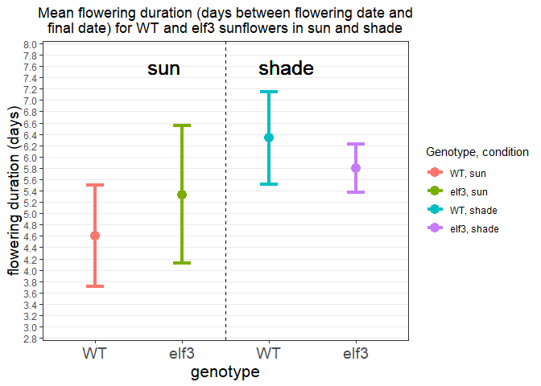<!-- -->

To summarize the results: Overall, sun/shade conditions appear to have little effect on mean flowering time in days (unpredictable at best). Furthermore, both genotypes appear to have the same mean flowering time. As a result, we might understand that the flowering time is likely unaffected by genotype. 


####Flowering Rate plots
First, plot for all data: 

```r
data %>%
  filter(flowering_rate != 0, flowering_rate != is.na(flowering_rate)) %>%
  ggplot(aes(geno_cond, flowering_rate, fill = geno_cond)) + 
  geom_boxplot() + 
  labs(title = "Flowering rate (flower diameter/flowering duration)\nfor WT and elf3 sunflowers in sun and shade", 
       x = "genotype", y = "flowering rate (cm/day)", fill = "Genotype, condition") +
  scale_fill_manual(values = c("#56B4E9","#D55E00", "#0072B2", "#009E73")) + 
  coord_cartesian(ylim = c(1.0, 7.0)) + 
  scale_y_continuous(breaks = seq(from = 0, to = 25, by = 0.5), minor_breaks = seq(from = 0, to = 25, by = 0.5)) + 
  scale_x_discrete(labels = c("WT", "elf3", "WT", "elf3")) +
  geom_vline(xintercept = 2.5, linetype = "dashed") + 
  geom_text(aes(x = 1.8, y = 6.5), label = "sun", size = 6.5) + 
  geom_text(aes(x = 3.2, y = 6.5), label = "shade", size = 6.5) +
  theme_bw() +
  theme(panel.grid.major.x = element_blank(), plot.title = element_text(hjust = 0.5), 
        axis.title.x = element_text(size = 16), 
        axis.title.y = element_text(size = 14), 
        axis.text.x = element_text(size = 14)) 
```

```
## Warning: Removed 11 rows containing non-finite values (stat_boxplot).
```

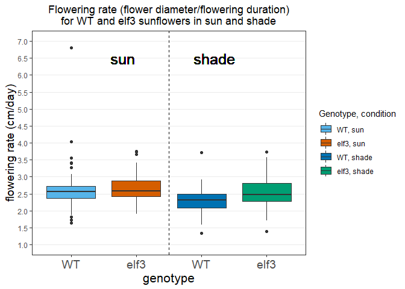<!-- -->

Now, plot by group: 

```r
data %>%
  filter(flowering_rate != 0, flowering_rate != is.na(flowering_rate), group == "A") %>%
  ggplot(aes(geno_cond, flowering_rate, fill = geno_cond)) + 
  geom_boxplot() + 
  labs(title = "Flowering rate (flower diameter/flowering duration)\nfor WT and elf3 sunflowers in sun and shade, Group A", 
       x = "genotype", y = "flowering rate (cm/day)", fill = "Genotype, condition") +
  scale_fill_manual(values = c("#56B4E9","#D55E00", "#0072B2", "#009E73")) + 
  coord_cartesian(ylim = c(1.0, 4.5)) + 
  scale_y_continuous(breaks = seq(from = 0, to = 25, by = 0.5), minor_breaks = seq(from = 0, to = 25, by = 0.5)) + 
  scale_x_discrete(labels = c("WT", "elf3", "WT", "elf3")) +
  geom_vline(xintercept = 2.5, linetype = "dashed") + 
  geom_text(aes(x = 1.8, y = 6.5), label = "sun", size = 6.5) + 
  geom_text(aes(x = 3.2, y = 6.5), label = "shade", size = 6.5) +
  theme_bw() +
  theme(panel.grid.major.x = element_blank(), plot.title = element_text(hjust = 0.5), 
        axis.title.x = element_text(size = 16), 
        axis.title.y = element_text(size = 14), 
        axis.text.x = element_text(size = 14)) 
```

```
## Warning: Removed 11 rows containing non-finite values (stat_boxplot).
```

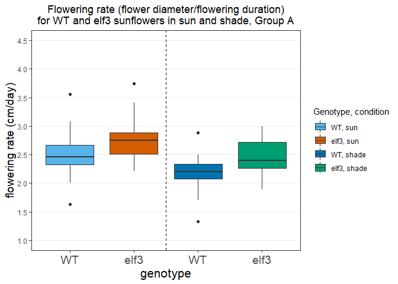<!-- -->

```r
data %>%
  filter(flowering_rate != 0, flowering_rate != is.na(flowering_rate), group == "B") %>%
  ggplot(aes(geno_cond, flowering_rate, fill = geno_cond)) + 
  geom_boxplot() + 
  labs(title = "Flowering rate (flower diameter/flowering duration)\nfor WT and elf3 sunflowers in sun and shade, Group B", 
       x = "genotype", y = "flowering rate (cm/day)", fill = "Genotype, condition") +
  scale_fill_manual(values = c("#56B4E9","#D55E00", "#0072B2", "#009E73")) + 
  coord_cartesian(ylim = c(1.0, 4.5)) + 
  scale_y_continuous(breaks = seq(from = 0, to = 25, by = 0.5), minor_breaks = seq(from = 0, to = 25, by = 0.5)) + 
  scale_x_discrete(labels = c("WT", "elf3", "WT", "elf3")) +
  geom_vline(xintercept = 2.5, linetype = "dashed") + 
  geom_text(aes(x = 1.8, y = 6.5), label = "sun", size = 6.5) + 
  geom_text(aes(x = 3.2, y = 6.5), label = "shade", size = 6.5) +
  theme_bw() +
  theme(panel.grid.major.x = element_blank(), plot.title = element_text(hjust = 0.5), 
        axis.title.x = element_text(size = 16), 
        axis.title.y = element_text(size = 14), 
        axis.text.x = element_text(size = 14)) 
```

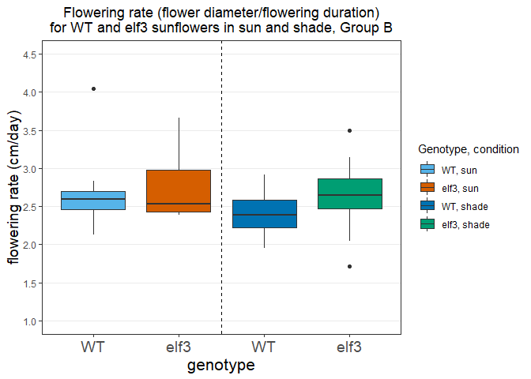<!-- -->

```r
data %>%
  filter(flowering_rate != 0, flowering_rate != is.na(flowering_rate), group == "C") %>%
  ggplot(aes(geno_cond, flowering_rate, fill = geno_cond)) + 
  geom_boxplot() + 
  labs(title = "Flowering rate (flower diameter/flowering duration)\nfor WT and elf3 sunflowers in sun and shade, Group C", 
       x = "genotype", y = "flowering rate (cm/day)", fill = "Genotype, condition") +
  scale_fill_manual(values = c("#56B4E9","#D55E00", "#0072B2", "#009E73")) + 
  coord_cartesian(ylim = c(1.0, 7.0)) + 
  scale_y_continuous(breaks = seq(from = 0, to = 25, by = 0.5), minor_breaks = seq(from = 0, to = 25, by = 0.5)) + 
  scale_x_discrete(labels = c("WT", "elf3", "WT", "elf3")) +
  geom_vline(xintercept = 2.5, linetype = "dashed") + 
  geom_text(aes(x = 1.8, y = 6.5), label = "sun", size = 6.5) + 
  geom_text(aes(x = 3.2, y = 6.5), label = "shade", size = 6.5) +
  theme_bw() +
  theme(panel.grid.major.x = element_blank(), plot.title = element_text(hjust = 0.5), 
        axis.title.x = element_text(size = 16), 
        axis.title.y = element_text(size = 14), 
        axis.text.x = element_text(size = 14)) 
```

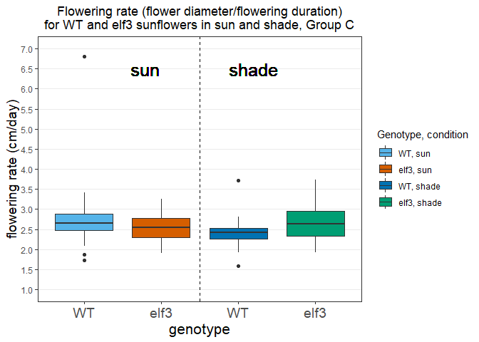<!-- -->

```r
data %>%
  filter(flowering_rate != 0, flowering_rate != is.na(flowering_rate), group == "D") %>%
  ggplot(aes(geno_cond, flowering_rate, fill = geno_cond)) + 
  geom_boxplot() + 
  labs(title = "Flowering rate (flower diameter/flowering duration)\nfor WT and elf3 sunflowers in sun and shade, Group D", 
       x = "genotype", y = "flowering rate (cm/day)", fill = "Genotype, condition") +
  scale_fill_manual(values = c("#56B4E9","#D55E00", "#0072B2", "#009E73")) + 
  coord_cartesian(ylim = c(1.0, 4.5)) + 
  scale_y_continuous(breaks = seq(from = 0, to = 25, by = 0.5), minor_breaks = seq(from = 0, to = 25, by = 0.5)) + 
  scale_x_discrete(labels = c("WT", "elf3", "WT", "elf3")) +
  geom_vline(xintercept = 2.5, linetype = "dashed") + 
  geom_text(aes(x = 1.8, y = 6.5), label = "sun", size = 6.5) + 
  geom_text(aes(x = 3.2, y = 6.5), label = "shade", size = 6.5) +
  theme_bw() +
  theme(panel.grid.major.x = element_blank(), plot.title = element_text(hjust = 0.5), 
        axis.title.x = element_text(size = 16), 
        axis.title.y = element_text(size = 14), 
        axis.text.x = element_text(size = 14)) 
```

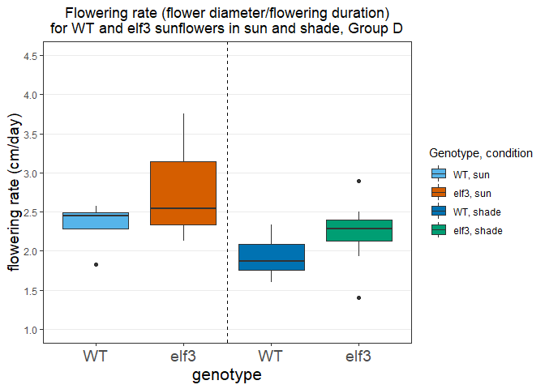<!-- -->

As with flowering duration, there appears to be no significant effect of either sun/shade condition or genotype on the flowering rate. However, there might be slightly higher flowering rate in elf3 plants (though the difference is so small that we would need statistical tests to verify this.)


####Leaf frequency plots


Next, let's look at leaf frequency. First, let's see if there's a relationship between leaf frequency and plant height:

```r
data %>%
  ggplot(aes(height, leaf_frequency, color = geno_cond)) + 
  geom_point() + 
  labs(title = "Leaf frequency (leaves/height) vs. height (cm) \nfor WT and elf3 sunflowers in sun or shade", x = "height (cm)", 
       y = "leaf frequency (leaves/cm)", color = "Genotype, condition") +
  scale_color_manual(values = c("#56B4E9","#D55E00", "#0072B2", "#009E73", "other colorblind-friendly colors")) + 
  coord_cartesian(ylim = c(0.2,0.55), xlim = c(50, 140)) + 
  scale_y_continuous(breaks = seq(from = 0, to = 7, by = 0.05), minor_breaks = seq(from = 0, to = 7, by = 0.05)) + 
  scale_x_continuous(breaks = seq(from = 50, to = 140, by = 15), minor_breaks = seq(from = 50, to = 140, by = 15)) +
  theme_bw() +
  theme(plot.title = element_text(hjust = 0.5), 
        axis.title.x = element_text(size = 14), 
        axis.title.y = element_text(size = 14), 
        axis.text.x = element_text(size = 11.5),
        axis.text.y = element_text(size = 11.5)) 
```

```
## Warning: Removed 53 rows containing missing values (geom_point).
```

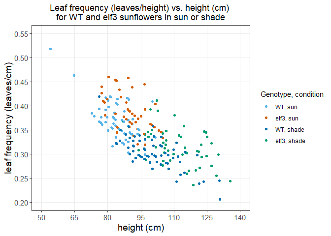<!-- -->

Very interesting! A general relationship between height and leaf frequency seems to hold for all plants. Surprisingly, taller plants, regardless of genotpe, seem to have lower leaf frequency; leaf frequency is negatively correlated with height. This graph also reveals that plants in the shade may be more biased towards lower leaf frequency due to having greater height; in other words, shade produces a significant effect on leaf frequency due to its effects on plant height. 

####Basic Template


```r
#data %>%
 # ggplot(aes(x, y, fill/color = var)) + 
  #geom() + 
  #labs(title = "title", x = "x", y = "y", fill = "Legend title") +
  #scale_fill_manual(values = c("#56B4E9","#D55E00", "#0072B2", "#009E73", "other colorblind-friendly colors")) + 
  #coord_cartesian(ylim = c(y1,y2), xlim = c(x1, x2)) + 
  #scale_y_continuous(breaks = seq(from = y1, to = y2, by = interval), minor_breaks = seq(from = y1, to = y2, by = interval)) + 
  #scale_x_discrete(labels = c("WT", "elf3", "WT", "elf3")) or scale_x_continuous(breaks = seq(from = x1, to = x2, by = interval), 
  #                                                                               minor_breaks = seq(from = x1, to = x2, by = interval)) +
  #geom_vline(xintercept = x, linetype = "linetype", color = "color") + 
  #geom_hline(yintercept = y, linetype = "linetype", color = "color") + 
  #geom_text(aes(x = x, y = y), label = "text", size = s) + 
  #theme_bw() +
  #theme(panel.grid.major.x = element_blank(), plot.title = element_text(hjust = 0.5), 
  #      axis.title.x = element_text(size = s), 
   #     axis.title.y = element_text(size = s), 
    #    axis.text.x = element_text(size = s)) 
```


###Question 3

OK, so we need to gather some data per Veronica's instructions. Let's see: 

```r
data_long <- data %>%
  pivot_longer(cols = yellow:final, names_to = "dev_stage", values_to = "dev_date")
data_long
```

```
## # A tibble: 846 x 22
##    DNA_ID field_ID genotype group row   row_ID `end?` condition germ      
##    <chr>  <chr>    <fct>    <fct> <chr>  <int> <fct>  <fct>     <date>    
##  1 D132   SUN_A_01 WT       A     SUN_A      1 end    sun       2019-06-07
##  2 D132   SUN_A_01 WT       A     SUN_A      1 end    sun       2019-06-07
##  3 D132   SUN_A_01 WT       A     SUN_A      1 end    sun       2019-06-07
##  4 D133   SUN_A_02 WT       A     SUN_A      2 end    sun       2019-06-08
##  5 D133   SUN_A_02 WT       A     SUN_A      2 end    sun       2019-06-08
##  6 D133   SUN_A_02 WT       A     SUN_A      2 end    sun       2019-06-08
##  7 D134   SUN_A_03 WT       A     SUN_A      3 middle sun       2019-06-08
##  8 D134   SUN_A_03 WT       A     SUN_A      3 middle sun       2019-06-08
##  9 D134   SUN_A_03 WT       A     SUN_A      3 middle sun       2019-06-08
## 10 D136   SUN_A_09 WT       A     SUN_A      9 middle sun       2019-06-08
## # ... with 836 more rows, and 13 more variables: diameter <dbl>,
## #   direction <chr>, height <dbl>, leaf_num <dbl>, ax_heads <dbl>, notes <chr>,
## #   flowering_time <int>, flowering_duration <int>, leaf_frequency <dbl>,
## #   flowering_rate <dbl>, geno_cond <fct>, dev_stage <chr>, dev_date <date>
```

```r
data_long$group <- factor(data_long$group, levels = c("D", "C", "B", "A"))
```

Now, we need to plot. `dev_date` on the x-axis, `group` on y. `geno_cond` likely to appear as a color.


```r
interval <- seq.Date(from = as.Date("2019-07-07"), to = as.Date("2019-12-1"), by = 7)
interval
```

```
##  [1] "2019-07-07" "2019-07-14" "2019-07-21" "2019-07-28" "2019-08-04"
##  [6] "2019-08-11" "2019-08-18" "2019-08-25" "2019-09-01" "2019-09-08"
## [11] "2019-09-15" "2019-09-22" "2019-09-29" "2019-10-06" "2019-10-13"
## [16] "2019-10-20" "2019-10-27" "2019-11-03" "2019-11-10" "2019-11-17"
## [21] "2019-11-24" "2019-12-01"
```

Let's plot the yellow dates, to try it out:

```r
data_long %>%
  filter(dev_stage == "yellow") %>%
  ggplot(aes(dev_date, group, fill = geno_cond)) +
  geom_boxplot() +
  labs(title = "Yellow date for each group, separated\nby genotype and sun/shade condition", 
       x = "yellow date", y = "group", fill = "Genotype, condition") +
  scale_fill_manual(values = c("#56B4E9","#D55E00", "#0072B2", "#009E73")) + 
  coord_cartesian(xlim = c(as.Date("2019-07-21"), as.Date("2019-09-01"))) + 
  scale_x_date(breaks = interval, 
                     minor_breaks = interval) +
  theme_bw() +
  theme(panel.grid.major.y = element_blank(), plot.title = element_text(hjust = 0.5), 
        axis.title.x = element_text(size = 14), 
        axis.title.y = element_text(size = 14), 
        axis.text.x = element_text(size = 10),
        axis.text.y = element_text(size = 12)) 
```

```
## Warning: Removed 21 rows containing non-finite values (stat_boxplot).
```

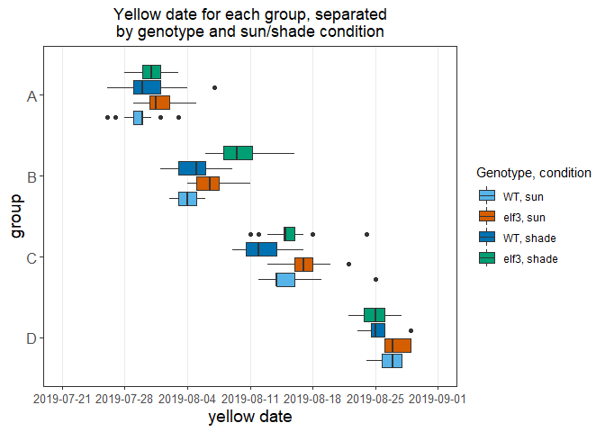<!-- -->

Next, the flowering and final dates: 

```r
data_long %>%
  filter(dev_stage == "flowering") %>%
  ggplot(aes(dev_date, group, fill = geno_cond)) +
  geom_boxplot() +
  labs(title = "Flowering date for each group, separated\nby genotype and sun/shade condition", 
       x = "flowering date", y = "group", fill = "Genotype, condition") +
  scale_fill_manual(values = c("#56B4E9","#D55E00", "#0072B2", "#009E73")) + 
  coord_cartesian(xlim = c(as.Date("2019-07-21"), as.Date("2019-09-08"))) + 
  scale_x_date(breaks = interval, 
                     minor_breaks = interval) +
  theme_bw() +
  theme(panel.grid.major.y = element_blank(), plot.title = element_text(hjust = 0.5), 
        axis.title.x = element_text(size = 14), 
        axis.title.y = element_text(size = 14), 
        axis.text.x = element_text(size = 7),
        axis.text.y = element_text(size = 12)) 
```

```
## Warning: Removed 16 rows containing non-finite values (stat_boxplot).
```

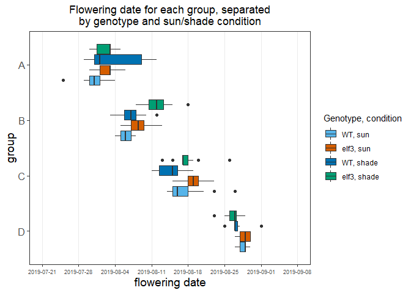<!-- -->

```r
data_long %>%
  filter(dev_stage == "final") %>%
  ggplot(aes(dev_date, group, fill = geno_cond)) +
  geom_boxplot() +
  labs(title = "Final date for each group, separated\nby genotype and sun/shade condition", 
       x = "final date", y = "group", fill = "Genotype, condition") +
  scale_fill_manual(values = c("#56B4E9","#D55E00", "#0072B2", "#009E73")) + 
  coord_cartesian(xlim = c(as.Date("2019-07-28"), as.Date("2019-09-08"))) + 
  scale_x_date(breaks = interval, 
                     minor_breaks = interval) +
  theme_bw() +
  theme(panel.grid.major.y = element_blank(), plot.title = element_text(hjust = 0.5), 
        axis.title.x = element_text(size = 14), 
        axis.title.y = element_text(size = 14), 
        axis.text.x = element_text(size = 10),
        axis.text.y = element_text(size = 12)) 
```

```
## Warning: Removed 28 rows containing non-finite values (stat_boxplot).
```

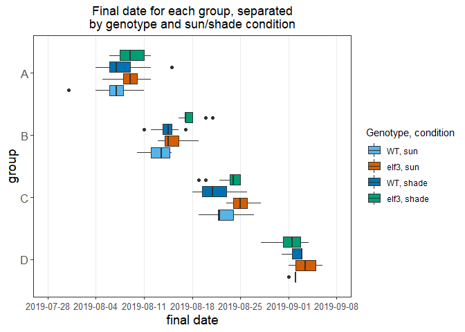<!-- -->
