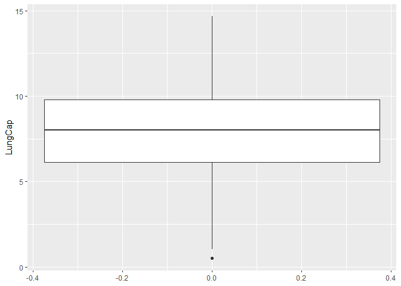
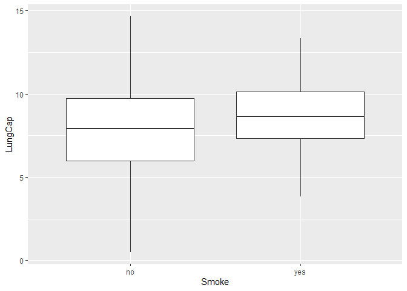
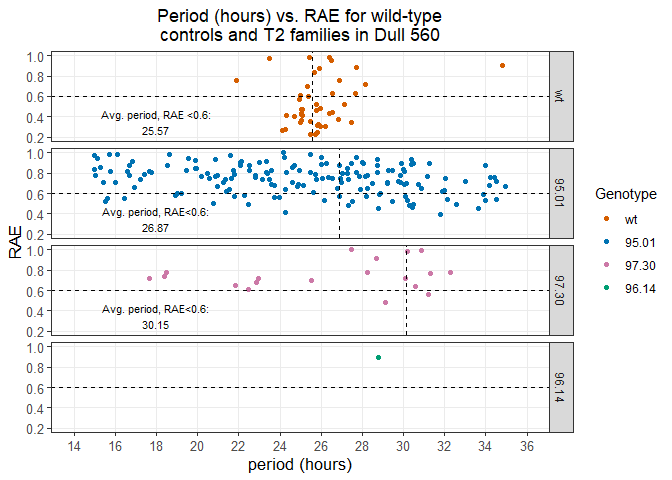

## Video Exercises

First, work through video exercises. Load up libraries:

```r
library(tidyverse)
```

```
## Warning: package 'tidyverse' was built under R version 3.5.3
```

```
## -- Attaching packages ---------------------------------------------------------------------------------------------------------------- tidyverse 1.3.0 --
```

```
## v ggplot2 3.3.0     v purrr   0.3.4
## v tibble  3.0.1     v dplyr   0.8.5
## v tidyr   1.0.2     v stringr 1.4.0
## v readr   1.3.1     v forcats 0.4.0
```

```
## Warning: package 'ggplot2' was built under R version 3.5.3
```

```
## Warning: package 'tibble' was built under R version 3.5.3
```

```
## Warning: package 'tidyr' was built under R version 3.5.3
```

```
## Warning: package 'readr' was built under R version 3.5.3
```

```
## Warning: package 'purrr' was built under R version 3.5.3
```

```
## Warning: package 'dplyr' was built under R version 3.5.3
```

```
## Warning: package 'stringr' was built under R version 3.5.3
```

```
## Warning: package 'forcats' was built under R version 3.5.3
```

```
## -- Conflicts ------------------------------------------------------------------------------------------------------------------- tidyverse_conflicts() --
## x dplyr::filter() masks stats::filter()
## x dplyr::lag()    masks stats::lag()
```

### One-Sample Confidence Interval and t-test
Appropriate for examining a single independent variable. 

Import dataset: 

```r
LungCapData <- read_tsv("LungCapData.txt")
```

```
## Parsed with column specification:
## cols(
##   LungCap = col_double(),
##   Age = col_double(),
##   Height = col_double(),
##   Smoke = col_character(),
##   Gender = col_character(),
##   Caesarean = col_character()
## )
```

```r
summary(LungCapData)
```

```
##     LungCap            Age            Height         Smoke          
##  Min.   : 0.507   Min.   : 3.00   Min.   :45.30   Length:725        
##  1st Qu.: 6.150   1st Qu.: 9.00   1st Qu.:59.90   Class :character  
##  Median : 8.000   Median :13.00   Median :65.40   Mode  :character  
##  Mean   : 7.863   Mean   :12.33   Mean   :64.84                     
##  3rd Qu.: 9.800   3rd Qu.:15.00   3rd Qu.:70.30                     
##  Max.   :14.675   Max.   :19.00   Max.   :81.80                     
##     Gender           Caesarean        
##  Length:725         Length:725        
##  Class :character   Class :character  
##  Mode  :character   Mode  :character  
##                                       
##                                       
## 
```

```r
head(LungCapData)
```

```
## # A tibble: 6 x 6
##   LungCap   Age Height Smoke Gender Caesarean
##     <dbl> <dbl>  <dbl> <chr> <chr>  <chr>    
## 1    6.48     6   62.1 no    male   no       
## 2   10.1     18   74.7 yes   female no       
## 3    9.55    16   69.7 no    female yes      
## 4   11.1     14   71   no    male   no       
## 5    4.8      5   56.9 no    male   no       
## 6    6.22    11   58.7 no    female no
```

```r
LungCapData$Caesarean <- parse_factor(LungCapData$Caesarean)
summary(LungCapData)
```

```
##     LungCap            Age            Height         Smoke          
##  Min.   : 0.507   Min.   : 3.00   Min.   :45.30   Length:725        
##  1st Qu.: 6.150   1st Qu.: 9.00   1st Qu.:59.90   Class :character  
##  Median : 8.000   Median :13.00   Median :65.40   Mode  :character  
##  Mean   : 7.863   Mean   :12.33   Mean   :64.84                     
##  3rd Qu.: 9.800   3rd Qu.:15.00   3rd Qu.:70.30                     
##  Max.   :14.675   Max.   :19.00   Max.   :81.80                     
##     Gender          Caesarean
##  Length:725         no :561  
##  Class :character   yes:164  
##  Mode  :character            
##                              
##                              
## 
```

Access documentation for dataset and quickly visualize: 

```r
?t.test()
```

```
## starting httpd help server ... done
```

```r
ggplot(LungCapData, aes(y = LungCap)) +
  geom_boxplot()
```

<!-- -->

Goals for our t-test: We would like to use `t.test()` to determine whether the mean for lung capacity is less than 8. Secondarily, we would like to obtain a one-sided 95% confidence interval for the mean. Recall that, statistically, these goals are practically the same. As a consequence, `t.test()` can tell us both of these pieces of information. 

```r
t.test(LungCapData$LungCap, mu = 8, alternative = "less", conf.level = 0.95)
```

```
## 
## 	One Sample t-test
## 
## data:  LungCapData$LungCap
## t = -1.3842, df = 724, p-value = 0.08336
## alternative hypothesis: true mean is less than 8
## 95 percent confidence interval:
##      -Inf 8.025974
## sample estimates:
## mean of x 
##  7.863148
```

We could convert this into a two-sided t-test and get a complete 95% confidence interval by changing the argument `alternative`. (This is also the default argument in R). 

```r
t.test(LungCapData$LungCap, mu = 8, alternative = "two.sided", conf.level = 0.95)
```

```
## 
## 	One Sample t-test
## 
## data:  LungCapData$LungCap
## t = -1.3842, df = 724, p-value = 0.1667
## alternative hypothesis: true mean is not equal to 8
## 95 percent confidence interval:
##  7.669052 8.057243
## sample estimates:
## mean of x 
##  7.863148
```

Next: 99% CI and store in a variable. 

```r
TEST <- t.test(LungCapData$LungCap, mu = 8, conf.level = 0.99)
```

Recall that we can examine the attributes of this object and extract them as follows: 

```r
attributes(TEST)
```

```
## $names
## [1] "statistic"   "parameter"   "p.value"     "conf.int"    "estimate"   
## [6] "null.value"  "alternative" "method"      "data.name"  
## 
## $class
## [1] "htest"
```

```r
TEST$p.value
```

```
## [1] 0.1667108
```


### Two-Sample t-test (Independent groups)

Appropriate for examining the difference in means for two independent populations. Examines relationship between categorical and numerical variable. 
Load data into R: 

```r
LungCapData <- read_tsv("LungCapData.txt")
```

```
## Parsed with column specification:
## cols(
##   LungCap = col_double(),
##   Age = col_double(),
##   Height = col_double(),
##   Smoke = col_character(),
##   Gender = col_character(),
##   Caesarean = col_character()
## )
```

```r
LungCapData$Caesarean <- parse_factor(LungCapData$Caesarean)
summary(LungCapData)
```

```
##     LungCap            Age            Height         Smoke          
##  Min.   : 0.507   Min.   : 3.00   Min.   :45.30   Length:725        
##  1st Qu.: 6.150   1st Qu.: 9.00   1st Qu.:59.90   Class :character  
##  Median : 8.000   Median :13.00   Median :65.40   Mode  :character  
##  Mean   : 7.863   Mean   :12.33   Mean   :64.84                     
##  3rd Qu.: 9.800   3rd Qu.:15.00   3rd Qu.:70.30                     
##  Max.   :14.675   Max.   :19.00   Max.   :81.80                     
##     Gender          Caesarean
##  Length:725         no :561  
##  Class :character   yes:164  
##  Mode  :character            
##                              
##                              
## 
```

We could also conduct two-sample t-tests using `t.test()`. In this case, we want to examine the difference in mean lung capacity between smokers and nonsmokers. Let's quickly take a look at the `t.test()` documentation and the data: 

```r
?t.test()

ggplot(LungCapData, aes(x = Smoke, y = LungCap)) + 
  geom_boxplot()
```

<!-- -->

In this case, our null is that lung capacities are the same between the two groups. We will start by performing a two-sample test and assume non-equal variances (?). In this case, also note `mu = 0` (i.e. difference in means is 0). 

```r
t.test(LungCapData$LungCap ~ LungCapData$Smoke, mu = 0 , alternative = "two.sided", conf = 0.95, var.equal = FALSE)
```

```
## 
## 	Welch Two Sample t-test
## 
## data:  LungCapData$LungCap by LungCapData$Smoke
## t = -3.6498, df = 117.72, p-value = 0.0003927
## alternative hypothesis: true difference in means is not equal to 0
## 95 percent confidence interval:
##  -1.3501778 -0.4003548
## sample estimates:
##  mean in group no mean in group yes 
##          7.770188          8.645455
```

Changing argument parameters would have the following effect on our t-test: 
* `mu`: Test for difference other than 0 
* `alt`: Perform one- or two-sided test
* `conf`:  Change confidence 
* `var.equal`: Assume equal variances, or not 
* `paired`: Perform paired sample t-test, or not

We could also specify which groups we wish to compare. Example: 

```r
t.test(LungCapData$LungCap[LungCapData$Smoke == "no"], LungCapData$LungCap[LungCapData$Smoke == "yes"], mu = 0 , alternative = "two.sided", conf = 0.95, var.equal = FALSE)
```

```
## 
## 	Welch Two Sample t-test
## 
## data:  LungCapData$LungCap[LungCapData$Smoke == "no"] and LungCapData$LungCap[LungCapData$Smoke == "yes"]
## t = -3.6498, df = 117.72, p-value = 0.0003927
## alternative hypothesis: true difference in means is not equal to 0
## 95 percent confidence interval:
##  -1.3501778 -0.4003548
## sample estimates:
## mean of x mean of y 
##  7.770188  8.645455
```

Another example: assume equal variances: 

```r
t.test(LungCapData$LungCap ~ LungCapData$Smoke, mu = 0 , alternative = "two.sided", conf = 0.95, var.equal = TRUE)
```

```
## 
## 	Two Sample t-test
## 
## data:  LungCapData$LungCap by LungCapData$Smoke
## t = -2.7399, df = 723, p-value = 0.006297
## alternative hypothesis: true difference in means is not equal to 0
## 95 percent confidence interval:
##  -1.5024262 -0.2481063
## sample estimates:
##  mean in group no mean in group yes 
##          7.770188          8.645455
```

How should we decide to assume equal or not equal variances? One way is to examine the boxplot we made earlier. This boxplot shows that variance in lung capacity is likely greater among nonsmokers than among smokers, so we might not assume equal variances on that basis. We might also use `var()`. 

```r
var(LungCapData$LungCap[LungCapData$Smoke == "no"])
```

```
## [1] 7.431694
```

```r
var(LungCapData$LungCap[LungCapData$Smoke == "yes"])
```

```
## [1] 3.545292
```

Clearly, variances are not equal. A third method would be to use Levene's Test. This test is appropriate for determining whether the variances of two populations are equal. It tests the null hypothesis that the two populations have equal variance. It is contained within the `car` package. 

```r
library(car)
```

```
## Warning: package 'car' was built under R version 3.5.3
```

```
## Loading required package: carData
```

```
## Warning: package 'carData' was built under R version 3.5.3
```

```
## 
## Attaching package: 'car'
```

```
## The following object is masked from 'package:dplyr':
## 
##     recode
```

```
## The following object is masked from 'package:purrr':
## 
##     some
```

Now, we can run our Levene's test: 

```r
?leveneTest()
attach(LungCapData)

leveneTest(LungCap ~ Smoke)
```

```
## Warning in leveneTest.default(y = y, group = group, ...): group coerced to
## factor.
```

```
## Levene's Test for Homogeneity of Variance (center = median)
##        Df F value    Pr(>F)    
## group   1  12.955 0.0003408 ***
##       723                      
## ---
## Signif. codes:  0 '***' 0.001 '**' 0.01 '*' 0.05 '.' 0.1 ' ' 1
```

In this case, we want to *accept* the null. Rejecting it, as in this case, indicates that population variances are not equal. 

## Dull 560 Exploration 

Next, let's work with my Dull560 luciferase assay dataset. Let's load in the data and make sure that everything is peachy: 

```r
library(tidyverse) 
```

```r
Luc_data <- read_csv("Dull 560_All_Results.csv")
```

```
## Parsed with column specification:
## cols(
##   .default = col_double(),
##   Genotype = col_character(),
##   `12` = col_logical(),
##   `14` = col_logical(),
##   `16` = col_logical(),
##   `18` = col_logical(),
##   `20` = col_logical(),
##   `22` = col_logical(),
##   `24` = col_logical(),
##   `26` = col_logical(),
##   `28` = col_logical(),
##   `30` = col_logical(),
##   `32` = col_logical(),
##   `34` = col_logical()
## )
```

```
## See spec(...) for full column specifications.
```

```r
#DO NOT USE SUMMARY. GO WITH `head` INSTEAD. 
head(Luc_data)
```

```
## # A tibble: 6 x 89
##   Region Genotype Period Amplitude  Phase   RAE `12`  `14`  `16`  `18`  `20` 
##    <dbl> <chr>     <dbl>     <dbl>  <dbl> <dbl> <lgl> <lgl> <lgl> <lgl> <lgl>
## 1    119 col        25.5     1087   10.4   0.23 NA    NA    NA    NA    NA   
## 2    325 col        25.7      748.  11.5   0.23 NA    NA    NA    NA    NA   
## 3    167 col        25.8     1355    9.56  0.25 NA    NA    NA    NA    NA   
## 4     73 col        24.1     1853    7.49  0.27 NA    NA    NA    NA    NA   
## 5    320 col        24.3     1224    9.2   0.28 NA    NA    NA    NA    NA   
## 6     71 col        26.0      896. -12.7   0.31 NA    NA    NA    NA    NA   
## # ... with 78 more variables: `22` <lgl>, `24` <lgl>, `26` <lgl>, `28` <lgl>,
## #   `30` <lgl>, `32` <lgl>, `34` <lgl>, `36` <dbl>, `38` <dbl>, `40` <dbl>,
## #   `42` <dbl>, `44` <dbl>, `46` <dbl>, `48` <dbl>, `50` <dbl>, `52` <dbl>,
## #   `54` <dbl>, `56` <dbl>, `58` <dbl>, `60` <dbl>, `62` <dbl>, `64` <dbl>,
## #   `66` <dbl>, `68` <dbl>, `70` <dbl>, `72` <dbl>, `74` <dbl>, `76` <dbl>,
## #   `78` <dbl>, `80` <dbl>, `82` <dbl>, `84` <dbl>, `86` <dbl>, `88` <dbl>,
## #   `90` <dbl>, `92` <dbl>, `94` <dbl>, `96` <dbl>, `98` <dbl>, `100` <dbl>,
## #   `102` <dbl>, `104` <dbl>, `106` <dbl>, `108` <dbl>, `110` <dbl>,
## #   `112` <dbl>, `114` <dbl>, `116` <dbl>, `118` <dbl>, `120` <dbl>,
## #   `122` <dbl>, `124` <dbl>, `126` <dbl>, `128` <dbl>, `130` <dbl>,
## #   `132` <dbl>, `134` <dbl>, `136` <dbl>, `138` <dbl>, `140` <dbl>,
## #   `142` <dbl>, `144` <dbl>, `146` <dbl>, `148` <dbl>, `150` <dbl>,
## #   `152` <dbl>, `154` <dbl>, `156` <dbl>, `158` <dbl>, `160` <dbl>,
## #   `162` <dbl>, `164` <dbl>, `166` <dbl>, `168` <dbl>, `170` <dbl>,
## #   `172` <dbl>, `174` <dbl>, `176` <dbl>
```

```r
#We could parse some of the data a bit better. 
Luc_data$Genotype <- parse_factor(Luc_data$Genotype)
head(Luc_data)
```

```
## # A tibble: 6 x 89
##   Region Genotype Period Amplitude  Phase   RAE `12`  `14`  `16`  `18`  `20` 
##    <dbl> <fct>     <dbl>     <dbl>  <dbl> <dbl> <lgl> <lgl> <lgl> <lgl> <lgl>
## 1    119 col        25.5     1087   10.4   0.23 NA    NA    NA    NA    NA   
## 2    325 col        25.7      748.  11.5   0.23 NA    NA    NA    NA    NA   
## 3    167 col        25.8     1355    9.56  0.25 NA    NA    NA    NA    NA   
## 4     73 col        24.1     1853    7.49  0.27 NA    NA    NA    NA    NA   
## 5    320 col        24.3     1224    9.2   0.28 NA    NA    NA    NA    NA   
## 6     71 col        26.0      896. -12.7   0.31 NA    NA    NA    NA    NA   
## # ... with 78 more variables: `22` <lgl>, `24` <lgl>, `26` <lgl>, `28` <lgl>,
## #   `30` <lgl>, `32` <lgl>, `34` <lgl>, `36` <dbl>, `38` <dbl>, `40` <dbl>,
## #   `42` <dbl>, `44` <dbl>, `46` <dbl>, `48` <dbl>, `50` <dbl>, `52` <dbl>,
## #   `54` <dbl>, `56` <dbl>, `58` <dbl>, `60` <dbl>, `62` <dbl>, `64` <dbl>,
## #   `66` <dbl>, `68` <dbl>, `70` <dbl>, `72` <dbl>, `74` <dbl>, `76` <dbl>,
## #   `78` <dbl>, `80` <dbl>, `82` <dbl>, `84` <dbl>, `86` <dbl>, `88` <dbl>,
## #   `90` <dbl>, `92` <dbl>, `94` <dbl>, `96` <dbl>, `98` <dbl>, `100` <dbl>,
## #   `102` <dbl>, `104` <dbl>, `106` <dbl>, `108` <dbl>, `110` <dbl>,
## #   `112` <dbl>, `114` <dbl>, `116` <dbl>, `118` <dbl>, `120` <dbl>,
## #   `122` <dbl>, `124` <dbl>, `126` <dbl>, `128` <dbl>, `130` <dbl>,
## #   `132` <dbl>, `134` <dbl>, `136` <dbl>, `138` <dbl>, `140` <dbl>,
## #   `142` <dbl>, `144` <dbl>, `146` <dbl>, `148` <dbl>, `150` <dbl>,
## #   `152` <dbl>, `154` <dbl>, `156` <dbl>, `158` <dbl>, `160` <dbl>,
## #   `162` <dbl>, `164` <dbl>, `166` <dbl>, `168` <dbl>, `170` <dbl>,
## #   `172` <dbl>, `174` <dbl>, `176` <dbl>
```

We kind of need to fix genotype names. 

```r
summary(Luc_data$Genotype)
```

```
##         col 8x T2 95.01 8x T2 97.30 8x T2 96.14 
##          44         164          19           1
```

```r
names <- tribble( 
  ~Genotype,  ~true_genotype,
    "col",         "wt", 
    "8x T2 95.01",  "95.01", 
    "8x T2 97.30",  "97.30", 
    "8x T2 96.14",  "96.14"
  )

Luc_data_compact <- Luc_data %>%
  left_join(names, by = "Genotype") %>%
  select(Region:RAE, true_genotype)
```

```
## Warning: Column `Genotype` joining factor and character vector, coercing into
## character vector
```

```r
Luc_data_compact$Genotype <- parse_factor(Luc_data_compact$Genotype)
Luc_data_compact$true_genotype <- parse_factor(Luc_data_compact$true_genotype)

Luc_data2 <- Luc_data%>%
  left_join(names, by = "Genotype")
```

```
## Warning: Column `Genotype` joining factor and character vector, coercing into
## character vector
```

```r
Luc_data2$Genotype <- parse_factor(Luc_data2$Genotype)
Luc_data2$true_genotype <- parse_factor(Luc_data2$true_genotype)

head(Luc_data_compact)
```

```
## # A tibble: 6 x 7
##   Region Genotype Period Amplitude  Phase   RAE true_genotype
##    <dbl> <fct>     <dbl>     <dbl>  <dbl> <dbl> <fct>        
## 1    119 col        25.5     1087   10.4   0.23 wt           
## 2    325 col        25.7      748.  11.5   0.23 wt           
## 3    167 col        25.8     1355    9.56  0.25 wt           
## 4     73 col        24.1     1853    7.49  0.27 wt           
## 5    320 col        24.3     1224    9.2   0.28 wt           
## 6     71 col        26.0      896. -12.7   0.31 wt
```

```r
summary(Luc_data_compact)
```

```
##      Region              Genotype       Period        Amplitude      
##  Min.   :  1.00   col        : 44   Min.   :15.00   Min.   :  157.3  
##  1st Qu.: 74.75   8x T2 95.01:164   1st Qu.:22.21   1st Qu.: 2741.8  
##  Median :159.00   8x T2 97.30: 19   Median :25.73   Median : 7806.0  
##  Mean   :157.64   8x T2 96.14:  1   Mean   :25.31   Mean   : 8992.2  
##  3rd Qu.:237.50                     3rd Qu.:28.75   3rd Qu.:12997.5  
##  Max.   :326.00                     Max.   :34.93   Max.   :34170.0  
##      Phase               RAE         true_genotype
##  Min.   :-16.1100   Min.   :0.2300   wt   : 44    
##  1st Qu.: -5.5225   1st Qu.:0.5775   95.01:164    
##  Median :  0.0650   Median :0.7400   97.30: 19    
##  Mean   :  0.3175   Mean   :0.7035   96.14:  1    
##  3rd Qu.:  7.2475   3rd Qu.:0.8400                
##  Max.   : 14.8800   Max.   :1.0000
```

```r
#Let's take the chance to also set the colors we want. 
colors <- c("wt" = "#D55E00", 
            "95.01" = "#0072B2", 
            "97.30" = "#CC79A7", 
            "96.14" = "#009E73")
```

To complete the "extra challenge", we need to determine the average period for plants with RAE < 0.6. 

```r
averages <- Luc_data_compact %>%
  filter(RAE < 0.6) %>%
  group_by(true_genotype) %>%
  summarise_each(funs = mean) %>%
  select(true_genotype, Period) 
```

```
## Warning in mean.default(Genotype): argument is not numeric or logical: returning
## NA

## Warning in mean.default(Genotype): argument is not numeric or logical: returning
## NA

## Warning in mean.default(Genotype): argument is not numeric or logical: returning
## NA
```

```r
averages
```

```
## # A tibble: 3 x 2
##   true_genotype Period
##   <fct>          <dbl>
## 1 wt              25.6
## 2 95.01           26.9
## 3 97.30           30.2
```

Now, we can do a neat little trick I snatched off the internet. 

```r
average_text <- tibble(
  true_genotype = averages$true_genotype, 
  label = c("Avg. period, RAE <0.6:\n25.57", "Avg. period, RAE<0.6:\n26.87", "Avg. period, RAE<0.6:\n30.15"),
  x = c(18, 18, 18), 
  y = c(0.35, 0.35, 0.35)
)
```

Nice! We should have everything we need now. Next, we need a graph of period and RAE: 

```r
Luc_data_compact %>%
  ggplot(aes(Period, RAE, color = true_genotype)) + 
  geom_point() + 
  labs(title = "Period (hours) vs. RAE for wild-type\ncontrols and T2 families in Dull 560", 
       x = "period (hours)", 
       y = "RAE", 
       color = "Genotype") +
  scale_color_manual(values = colors) + 
  scale_y_continuous(breaks = seq(from = 0.2, to = 1.0, by = 0.2), minor_breaks = seq(from = 0.2, to = 1.0, by = 0.2)) + 
  scale_x_continuous(breaks = seq(from = 14, to = 36, by = 2), minor_breaks = seq(from = 14, to = 36, by = 2)) +
  geom_hline(yintercept = 0.6, linetype = "dashed", color = "black") + 
  theme_bw() +
  coord_cartesian(xlim = c(14, 36), ylim = c(0.2, 1.0)) +
  theme(plot.title = element_text(hjust = 0.5), 
        axis.title.x = element_text(size = 13), 
        axis.title.y = element_text(size = 13), 
        axis.text.x = element_text(size = 9.5),
        axis.text.y = element_text(size = 9.5)
        ) + 
  facet_wrap(~true_genotype , nrow = 4, ncol = 1, strip.position = "right") +
  geom_text(data = average_text, mapping = aes(x = x, y = y, label = label), color = "black", size = 3) + 
  geom_vline(data = averages, mapping = aes(xintercept = Period), color = "black", linetype = "dashed")
```

<!-- -->

Let's go, too easy. 

Now, to plot luminescence vs. time for a particular plant or genotype. 

Particular plant: Isolate data from plant, then group ZT times into a new column, `time`, and keep the luminescence values in a new column, `lum`. Then plot. Example, with plant 73: 

```r
Plant73 <- Luc_data2 %>%
  filter(Region == 73) %>%
  select(Region, '36':'176') %>%
  pivot_longer(cols = '36':'176', names_to = "time", values_to = "lum") 

head(Plant73)
```

```
## # A tibble: 6 x 3
##   Region time      lum
##    <dbl> <chr>   <dbl>
## 1     73 36    112052.
## 2     73 38    111949.
## 3     73 40    112186.
## 4     73 42    113246.
## 5     73 44    112307.
## 6     73 46    111841.
```

Particular genotype: to do the same thing with genotype, we would need to group plants by genotype and summarize luminescence values instead of isolating data from a particular plant. All other steps should remain the same. 

```r
Lum_vs_time <- Luc_data2 %>%
  select(true_genotype, '36':'176') %>%
  group_by(true_genotype) %>%
  summarize_each(funs = mean) %>%
  pivot_longer(cols = '36':'176', names_to = "time", values_to = "lum")
Lum_vs_time$time <- parse_integer(Lum_vs_time$time)

head(Lum_vs_time)
```

```
## # A tibble: 6 x 3
##   true_genotype  time    lum
##   <fct>         <int>  <dbl>
## 1 wt               36 79009.
## 2 wt               38 79130.
## 3 wt               40 79454.
## 4 wt               42 79498.
## 5 wt               44 79436.
## 6 wt               46 79431.
```

```r
Lum_vs_time
```

```
## # A tibble: 284 x 3
##    true_genotype  time    lum
##    <fct>         <int>  <dbl>
##  1 wt               36 79009.
##  2 wt               38 79130.
##  3 wt               40 79454.
##  4 wt               42 79498.
##  5 wt               44 79436.
##  6 wt               46 79431.
##  7 wt               48 79103.
##  8 wt               50 78534.
##  9 wt               52 78258.
## 10 wt               54 78294.
## # ... with 274 more rows
```
