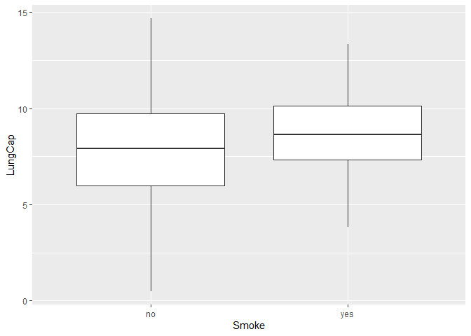
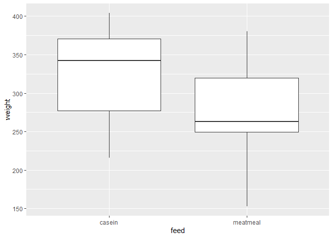

## R4DS Exercises

### Chapter 19 Exercises/Notes
Three things needed to develop a function in R: 
1. The function *name*
2. The function *inputs*
3. The function *code* (typically developed outside the function itself). 

19.2.1 #3. Turn the following code into functions: 
```{}
a. mean(is.na(x))

b. x / sum(x, na.rm = TRUE)

c. sd(x, na.rm = TRUE) / mean(x, na.rm = TRUE)
```

Let's make some test datasets first: 

```r
test <- c(1, 3, 4, 5, 6)

test_na <- c(1,3, NA, 4, 5, 6)
```

Next, let's try a:

```r
is.na(test)
```

```
## [1] FALSE FALSE FALSE FALSE FALSE
```

```r
mean(is.na(test))
```

```
## [1] 0
```

```r
mean(is.na(test_na))
```

```
## [1] 0.1666667
```

```r
#Clearly, this describes the proportion of the dataset that is missing. 
percent_missing <- function(x) {
  mean(is.na(x))
}
#Next, let's test it out: 
percent_missing(test)
```

```
## [1] 0
```

```r
percent_missing(test_na)
```

```
## [1] 0.1666667
```

Moving on to b: 

```r
#I'm not exactly sure what's being calculated here. 
test/sum(test, na.rm = TRUE)
```

```
## [1] 0.05263158 0.15789474 0.21052632 0.26315789 0.31578947
```

```r
val_proportion <- function(x) {
  x / sum(x, na.rm = TRUE)
}
val_proportion(test)
```

```
## [1] 0.05263158 0.15789474 0.21052632 0.26315789 0.31578947
```

Moving on to c: 

```r
#OK, this is clearly a calculation of the dataset's standard error of the mean. 
sd(test, na.rm = TRUE) / mean(test, na.rm = TRUE) 
```

```
## [1] 0.5061943
```

```r
sem <- function(x) {
  sd(x, na.rm = TRUE) / mean(x, na.rm = TRUE) 
}
sem(test)
```

```
## [1] 0.5061943
```
No problemo. 

19.4.4 #3
Implement a `fizzbuzz` function. It takes a single number as input. If the number is divisible by three, it returns “fizz”. If it’s divisible by five it returns “buzz”. If it’s divisible by three and five, it returns “fizzbuzz”. Otherwise, it returns the number. Make sure you first write working code before you create the function.

```r
#I designed the framework for this code on scratch paper, so I'll keep it brief here and just show the final result. 
#Wow. This is complete bullshit. R actually doesn't have a function to check integers. Now I have to write one myself. 
integer_check <- function(x) {
  rounded <- round(x, digits = 0)
  difference <- rounded - x
  identical(difference, 0)
}


fizzbuzz <- function(x) {
  three_five_check <- x/15
  three_check <- x/3
  five_check <- x/5
  if (integer_check(three_five_check)){
    print("fizzbuzz", quote = FALSE)
} else if (integer_check(three_check)){
    print("fizz", quote = FALSE)
} else if (integer_check(five_check)){
    print("buzz", quote = FALSE)
} else {
  print(x)
}
}
```

Let's try it out. 

```r
fizzbuzz(15)
```

```
## [1] fizzbuzz
```

```r
fizzbuzz(20)
```

```
## [1] buzz
```

```r
fizzbuzz(8)
```

```
## [1] 8
```

```r
fizzbuzz(150)
```

```
## [1] fizzbuzz
```

```r
fizzbuzz(9)
```

```
## [1] fizz
```

```r
fizzbuzz(3)
```

```
## [1] fizz
```

```r
fizzbuzz(5)
```

```
## [1] buzz
```

```r
fizzbuzz(25)
```

```
## [1] buzz
```


### Chapter 21 Exercises/Notes 

```r
library(tidyverse)
```

```
## Warning: package 'tidyverse' was built under R version 3.5.3
```

```
## -- Attaching packages ---------------------------------------------------------------------------------------------------------------- tidyverse 1.3.0 --
```

```
## v ggplot2 3.3.0     v purrr   0.3.4
## v tibble  3.0.1     v dplyr   0.8.5
## v tidyr   1.0.2     v stringr 1.4.0
## v readr   1.3.1     v forcats 0.4.0
```

```
## Warning: package 'ggplot2' was built under R version 3.5.3
```

```
## Warning: package 'tibble' was built under R version 3.5.3
```

```
## Warning: package 'tidyr' was built under R version 3.5.3
```

```
## Warning: package 'readr' was built under R version 3.5.3
```

```
## Warning: package 'purrr' was built under R version 3.5.3
```

```
## Warning: package 'dplyr' was built under R version 3.5.3
```

```
## Warning: package 'stringr' was built under R version 3.5.3
```

```
## Warning: package 'forcats' was built under R version 3.5.3
```

```
## -- Conflicts ------------------------------------------------------------------------------------------------------------------- tidyverse_conflicts() --
## x dplyr::filter() masks stats::filter()
## x dplyr::lag()    masks stats::lag()
```

#### 21.2.1 #1
First: Compute the mean of every column in `mtcars`. 

```r
mtcars_means <- vector("double", ncol(mtcars)) 
for (i in seq_along(mtcars)) {
  mtcars_means[[i]] <- mean(mtcars[[i]])
}

#Now, to check: 
head(mtcars)
```

```
##                    mpg cyl disp  hp drat    wt  qsec vs am gear carb
## Mazda RX4         21.0   6  160 110 3.90 2.620 16.46  0  1    4    4
## Mazda RX4 Wag     21.0   6  160 110 3.90 2.875 17.02  0  1    4    4
## Datsun 710        22.8   4  108  93 3.85 2.320 18.61  1  1    4    1
## Hornet 4 Drive    21.4   6  258 110 3.08 3.215 19.44  1  0    3    1
## Hornet Sportabout 18.7   8  360 175 3.15 3.440 17.02  0  0    3    2
## Valiant           18.1   6  225 105 2.76 3.460 20.22  1  0    3    1
```

```r
mean(mtcars$drat) #should be the 5th value in `mtcars_means`
```

```
## [1] 3.596563
```

```r
mtcars_means
```

```
##  [1]  20.090625   6.187500 230.721875 146.687500   3.596563   3.217250
##  [7]  17.848750   0.437500   0.406250   3.687500   2.812500
```

```r
#Looks like it works. 
```

Next: Compute the number of unique values in each column of `iris`. 

```r
iris_unique <- vector("integer", ncol(iris)) 
for (i in seq_along(iris)) {
  iris_unique[[i]] <- iris[[i]] %>%
    table() %>%
    length()
}
#OK, that might have failed but let's try it anyways. 
iris_unique
```

```
## [1] 35 23 43 22  3
```

```r
head(iris)
```

```
##   Sepal.Length Sepal.Width Petal.Length Petal.Width Species
## 1          5.1         3.5          1.4         0.2  setosa
## 2          4.9         3.0          1.4         0.2  setosa
## 3          4.7         3.2          1.3         0.2  setosa
## 4          4.6         3.1          1.5         0.2  setosa
## 5          5.0         3.6          1.4         0.2  setosa
## 6          5.4         3.9          1.7         0.4  setosa
```

```r
length(table(iris$Sepal.Length))
```

```
## [1] 35
```

```r
length(table(iris$Species))
```

```
## [1] 3
```

```r
#WOW it actually worked 
```

Neat! Clearly, piping works within the for loop. 

#### 21.3.5 #3
Goal: Design a function that gives the mean of each numeric column in a data frame. Following the book's example, we can call it `show_mean`. Let's test out how we might get this function to work using `iris` and `LungCapData`. 

```r
lungs <- read_tsv("LungCapData.txt")
```

```
## Parsed with column specification:
## cols(
##   LungCap = col_double(),
##   Age = col_double(),
##   Height = col_double(),
##   Smoke = col_character(),
##   Gender = col_character(),
##   Caesarean = col_character()
## )
```


```r
show_mean <- function(x) {
  results <- vector("list", ncol(x))
  names(results) <- names(x)
  for (i in seq_along(x)) {
    if (class(x[[i]]) == "numeric") {
      results[[i]] <- mean(x[[i]])
}   else { 
  results[[i]] <- NA
}
}
results
}
```


```r
#Now, let's try it out: 
show_mean(iris)
```

```
## $Sepal.Length
## [1] 5.843333
## 
## $Sepal.Width
## [1] 3.057333
## 
## $Petal.Length
## [1] 3.758
## 
## $Petal.Width
## [1] 1.199333
## 
## $Species
## [1] NA
```

```r
show_mean(lungs)
```

```
## $LungCap
## [1] 7.863148
## 
## $Age
## [1] 12.3269
## 
## $Height
## [1] 64.83628
## 
## $Smoke
## [1] NA
## 
## $Gender
## [1] NA
## 
## $Caesarean
## [1] NA
```
ALright, I can't get this to work so I'm moving on. It's functional, but barely. 


#### 21.5.3 #1
As before, do #1 and #3 from this list. 
First, compute the mean of every column from `mtcars`. 

```r
mtcars %>%
  map_dbl(mean)
```

```
##        mpg        cyl       disp         hp       drat         wt       qsec 
##  20.090625   6.187500 230.721875 146.687500   3.596563   3.217250  17.848750 
##         vs         am       gear       carb 
##   0.437500   0.406250   3.687500   2.812500
```

Wow, that looks a lot cleaner. 

Next, compute the number of unique values in each column of iris. 

```r
iris %>%
  map(table) %>%
  map_dbl(length)
```

```
## Sepal.Length  Sepal.Width Petal.Length  Petal.Width      Species 
##           35           23           43           22            3
```

Again, a whole lot cleaner. 

## MarinStatsLectures
### Mann Whitney U Test 
Test is appropriate for examining difference in medians for two independent populations. 
Let's import and attach the dataset: 

```r
lungs <- read_tsv("LungCapData.txt")
```

```
## Parsed with column specification:
## cols(
##   LungCap = col_double(),
##   Age = col_double(),
##   Height = col_double(),
##   Smoke = col_character(),
##   Gender = col_character(),
##   Caesarean = col_character()
## )
```

```r
attach(lungs)
```

Assess relationship between smoking and lung capacity. Use `wilcox.test()` to conduct the test. First, boxplot to look at the data: 

```r
ggplot(lungs, aes(Smoke, LungCap)) + 
  geom_boxplot()
```

<!-- -->

In this case: 
H0: Median lung capacity of smokers = that of nonsmokers
All below are default values, except `conf.int`. 

```r
wilcox.test(LungCap ~ Smoke, mu = 0, alt = "two.sided", conf.int = TRUE, conf.level = 0.95, paired = FALSE, exact = TRUE, correct = TRUE)
```

```
## Warning in wilcox.test.default(x = c(6.475, 9.55, 11.125, 4.8, 6.225, 4.95, :
## cannot compute exact p-value with ties
```

```
## Warning in wilcox.test.default(x = c(6.475, 9.55, 11.125, 4.8, 6.225, 4.95, :
## cannot compute exact confidence intervals with ties
```

```
## 
## 	Wilcoxon rank sum test with continuity correction
## 
## data:  LungCap by Smoke
## W = 20128, p-value = 0.005538
## alternative hypothesis: true location shift is not equal to 0
## 95 percent confidence interval:
##  -1.3999731 -0.2499419
## sample estimates:
## difference in location 
##             -0.8000564
```

If we don't want to have exact p-values and confidence intervals calculated, we could change `exact`. 

### Bootstrap Hypothesis Testing 
Basically an alternative to the two-sample t-test. Let's load in the dataset and take a quick look at it: 

```r
chicks <- read_csv("ChickData.csv")
```

```
## Parsed with column specification:
## cols(
##   weight = col_double(),
##   feed = col_character()
## )
```

```r
head(chicks)
```

```
## # A tibble: 6 x 2
##   weight feed    
##    <dbl> <chr>   
## 1    325 meatmeal
## 2    257 meatmeal
## 3    303 meatmeal
## 4    315 meatmeal
## 5    380 meatmeal
## 6    153 meatmeal
```

```r
ggplot(chicks, aes(feed, weight)) + 
  geom_boxplot()
```

<!-- -->

There is some evidence that meal type does determine weight differences. 
We'll need to calculate some test statistics. First, let's calculate the difference in sample mean weights between the two feed types: 

```r
means <- chicks %>%
  group_by(feed) %>%
  summarise_each(funs = mean)
means
```

```
## # A tibble: 2 x 2
##   feed     weight
##   <chr>     <dbl>
## 1 casein     324.
## 2 meatmeal   277.
```
