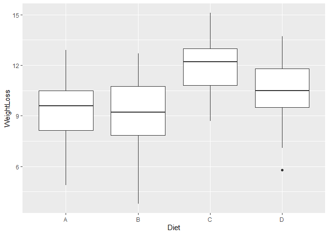

### Dull 560 Luc Data
Next, let's work with my Dull560 luciferase assay dataset. Let's load in the data and make sure that everything is peachy. We just need to copy-paste what we had from Week 4. 

```r
library(tidyverse) 
```

```
## Warning: package 'tidyverse' was built under R version 3.5.3
```

```
## -- Attaching packages ------------------- tidyverse 1.3.0 --
```

```
## v ggplot2 3.3.0     v purrr   0.3.4
## v tibble  3.0.1     v dplyr   0.8.5
## v tidyr   1.0.2     v stringr 1.4.0
## v readr   1.3.1     v forcats 0.4.0
```

```
## Warning: package 'ggplot2' was built under R version 3.5.3
```

```
## Warning: package 'tibble' was built under R version 3.5.3
```

```
## Warning: package 'tidyr' was built under R version 3.5.3
```

```
## Warning: package 'readr' was built under R version 3.5.3
```

```
## Warning: package 'purrr' was built under R version 3.5.3
```

```
## Warning: package 'dplyr' was built under R version 3.5.3
```

```
## Warning: package 'stringr' was built under R version 3.5.3
```

```
## Warning: package 'forcats' was built under R version 3.5.3
```

```
## -- Conflicts ---------------------- tidyverse_conflicts() --
## x dplyr::filter() masks stats::filter()
## x dplyr::lag()    masks stats::lag()
```

```r
Luc_data <- read_csv("Dull 560_All_Results.csv")
```

```
## Parsed with column specification:
## cols(
##   .default = col_double(),
##   Genotype = col_character(),
##   `12` = col_logical(),
##   `14` = col_logical(),
##   `16` = col_logical(),
##   `18` = col_logical(),
##   `20` = col_logical(),
##   `22` = col_logical(),
##   `24` = col_logical(),
##   `26` = col_logical(),
##   `28` = col_logical(),
##   `30` = col_logical(),
##   `32` = col_logical(),
##   `34` = col_logical()
## )
```

```
## See spec(...) for full column specifications.
```

```r
#We could parse some of the data a bit better. 
Luc_data$Genotype <- parse_factor(Luc_data$Genotype)

summary(Luc_data$Genotype)
```

```
##         col 8x T2 95.01 8x T2 97.30 8x T2 96.14 
##          44         164          19           1
```

```r
names <- tribble( 
  ~Genotype,  ~true_genotype,
    "col",         "wt", 
    "8x T2 95.01",  "95.01", 
    "8x T2 97.30",  "97.30", 
    "8x T2 96.14",  "96.14"
  )

Luc_data_compact <- Luc_data %>%
  left_join(names, by = "Genotype") %>%
  select(Region:RAE, true_genotype)
```

```
## Warning: Column `Genotype` joining factor and character vector, coercing into
## character vector
```

```r
Luc_data_compact$Genotype <- parse_factor(Luc_data_compact$Genotype)
Luc_data_compact$true_genotype <- parse_factor(Luc_data_compact$true_genotype)

Luc_data2 <- Luc_data %>%
  left_join(names, by = "Genotype") %>%
  select(Region:RAE, true_genotype, '36':'176')
```

```
## Warning: Column `Genotype` joining factor and character vector, coercing into
## character vector
```

```r
Luc_data2$Genotype <- parse_factor(Luc_data2$Genotype)
Luc_data2$true_genotype <- parse_factor(Luc_data2$true_genotype)

head(Luc_data2)
```

```
## # A tibble: 6 x 78
##   Region Genotype Period Amplitude  Phase   RAE true_genotype   `36`   `38`
##    <dbl> <fct>     <dbl>     <dbl>  <dbl> <dbl> <fct>          <dbl>  <dbl>
## 1    119 col        25.5     1087   10.4   0.23 wt            6.77e4 6.78e4
## 2    325 col        25.7      748.  11.5   0.23 wt            6.64e4 6.71e4
## 3    167 col        25.8     1355    9.56  0.25 wt            9.08e4 9.31e4
## 4     73 col        24.1     1853    7.49  0.27 wt            1.12e5 1.12e5
## 5    320 col        24.3     1224    9.2   0.28 wt            8.97e4 8.98e4
## 6     71 col        26.0      896. -12.7   0.31 wt            9.89e4 9.76e4
## # ... with 69 more variables: `40` <dbl>, `42` <dbl>, `44` <dbl>, `46` <dbl>,
## #   `48` <dbl>, `50` <dbl>, `52` <dbl>, `54` <dbl>, `56` <dbl>, `58` <dbl>,
## #   `60` <dbl>, `62` <dbl>, `64` <dbl>, `66` <dbl>, `68` <dbl>, `70` <dbl>,
## #   `72` <dbl>, `74` <dbl>, `76` <dbl>, `78` <dbl>, `80` <dbl>, `82` <dbl>,
## #   `84` <dbl>, `86` <dbl>, `88` <dbl>, `90` <dbl>, `92` <dbl>, `94` <dbl>,
## #   `96` <dbl>, `98` <dbl>, `100` <dbl>, `102` <dbl>, `104` <dbl>, `106` <dbl>,
## #   `108` <dbl>, `110` <dbl>, `112` <dbl>, `114` <dbl>, `116` <dbl>,
## #   `118` <dbl>, `120` <dbl>, `122` <dbl>, `124` <dbl>, `126` <dbl>,
## #   `128` <dbl>, `130` <dbl>, `132` <dbl>, `134` <dbl>, `136` <dbl>,
## #   `138` <dbl>, `140` <dbl>, `142` <dbl>, `144` <dbl>, `146` <dbl>,
## #   `148` <dbl>, `150` <dbl>, `152` <dbl>, `154` <dbl>, `156` <dbl>,
## #   `158` <dbl>, `160` <dbl>, `162` <dbl>, `164` <dbl>, `166` <dbl>,
## #   `168` <dbl>, `170` <dbl>, `172` <dbl>, `174` <dbl>, `176` <dbl>
```

```r
summary(Luc_data2)
```

```
##      Region              Genotype       Period        Amplitude      
##  Min.   :  1.00   col        : 44   Min.   :15.00   Min.   :  157.3  
##  1st Qu.: 74.75   8x T2 95.01:164   1st Qu.:22.21   1st Qu.: 2741.8  
##  Median :159.00   8x T2 97.30: 19   Median :25.73   Median : 7806.0  
##  Mean   :157.64   8x T2 96.14:  1   Mean   :25.31   Mean   : 8992.2  
##  3rd Qu.:237.50                     3rd Qu.:28.75   3rd Qu.:12997.5  
##  Max.   :326.00                     Max.   :34.93   Max.   :34170.0  
##      Phase               RAE         true_genotype       36        
##  Min.   :-16.1100   Min.   :0.2300   wt   : 44     Min.   : 64835  
##  1st Qu.: -5.5225   1st Qu.:0.5775   95.01:164     1st Qu.:191721  
##  Median :  0.0650   Median :0.7400   97.30: 19     Median :332807  
##  Mean   :  0.3175   Mean   :0.7035   96.14:  1     Mean   :352854  
##  3rd Qu.:  7.2475   3rd Qu.:0.8400                 3rd Qu.:508824  
##  Max.   : 14.8800   Max.   :1.0000                 Max.   :923386  
##        38               40               42               44        
##  Min.   : 64800   Min.   : 64970   Min.   : 65109   Min.   : 64711  
##  1st Qu.:187470   1st Qu.:185310   1st Qu.:189318   1st Qu.:189495  
##  Median :326738   Median :332865   Median :336502   Median :338623  
##  Mean   :348810   Mean   :352727   Mean   :359216   Mean   :363503  
##  3rd Qu.:501939   3rd Qu.:505098   3rd Qu.:521319   3rd Qu.:530956  
##  Max.   :925799   Max.   :930300   Max.   :956893   Max.   :974121  
##        46               48               50               52        
##  Min.   : 65184   Min.   : 64809   Min.   : 65059   Min.   : 64903  
##  1st Qu.:191871   1st Qu.:192516   1st Qu.:189825   1st Qu.:188596  
##  Median :337505   Median :341905   Median :339742   Median :334438  
##  Mean   :362378   Mean   :358839   Mean   :354731   Mean   :351086  
##  3rd Qu.:528406   3rd Qu.:521747   3rd Qu.:514852   3rd Qu.:505645  
##  Max.   :999917   Max.   :947913   Max.   :924359   Max.   :904619  
##        54               56               58               60        
##  Min.   : 64545   Min.   : 65228   Min.   : 65249   Min.   : 64784  
##  1st Qu.:186720   1st Qu.:190394   1st Qu.:193408   1st Qu.:193145  
##  Median :336305   Median :343152   Median :340348   Median :343268  
##  Mean   :352330   Mean   :356221   Mean   :359488   Mean   :361207  
##  3rd Qu.:506271   3rd Qu.:516980   3rd Qu.:530209   3rd Qu.:528219  
##  Max.   :908097   Max.   :937127   Max.   :975458   Max.   :986085  
##        62               64               66               68        
##  Min.   : 64800   Min.   : 64799   Min.   : 65391   Min.   : 64661  
##  1st Qu.:191138   1st Qu.:188638   1st Qu.:193104   1st Qu.:190506  
##  Median :336600   Median :328072   Median :332405   Median :336815  
##  Mean   :361479   Mean   :358655   Mean   :358114   Mean   :359587  
##  3rd Qu.:530545   3rd Qu.:523473   3rd Qu.:521424   3rd Qu.:525537  
##  Max.   :968428   Max.   :947300   Max.   :942839   Max.   :944398  
##        70               72               74               76        
##  Min.   : 65371   Min.   : 65358   Min.   : 65168   Min.   : 64899  
##  1st Qu.:193966   1st Qu.:192902   1st Qu.:191839   1st Qu.:193178  
##  Median :338823   Median :343491   Median :336691   Median :339911  
##  Mean   :361089   Mean   :363016   Mean   :362016   Mean   :360289  
##  3rd Qu.:519787   3rd Qu.:534392   3rd Qu.:530880   3rd Qu.:525083  
##  Max.   :963203   Max.   :980107   Max.   :955080   Max.   :958537  
##        78               80               82               84        
##  Min.   : 64782   Min.   : 64919   Min.   : 64738   Min.   : 65265  
##  1st Qu.:192602   1st Qu.:192193   1st Qu.:191788   1st Qu.:189654  
##  Median :335715   Median :334412   Median :335425   Median :338025  
##  Mean   :361617   Mean   :359608   Mean   :359399   Mean   :360116  
##  3rd Qu.:521290   3rd Qu.:516475   3rd Qu.:523855   3rd Qu.:527494  
##  Max.   :952914   Max.   :917488   Max.   :912083   Max.   :910992  
##        86               88               90               92        
##  Min.   : 65223   Min.   : 64678   Min.   : 65386   Min.   : 65495  
##  1st Qu.:192882   1st Qu.:188169   1st Qu.:188851   1st Qu.:191715  
##  Median :340879   Median :342235   Median :341717   Median :344355  
##  Mean   :360358   Mean   :360222   Mean   :361255   Mean   :360400  
##  3rd Qu.:529656   3rd Qu.:532164   3rd Qu.:530043   3rd Qu.:531045  
##  Max.   :907293   Max.   :930273   Max.   :958909   Max.   :959982  
##        94               96               98              100        
##  Min.   : 65634   Min.   : 64514   Min.   : 64978   Min.   : 64938  
##  1st Qu.:193421   1st Qu.:190540   1st Qu.:192043   1st Qu.:192691  
##  Median :336654   Median :337634   Median :336421   Median :333145  
##  Mean   :358740   Mean   :358961   Mean   :357357   Mean   :357412  
##  3rd Qu.:524791   3rd Qu.:524613   3rd Qu.:519577   3rd Qu.:513165  
##  Max.   :963934   Max.   :956581   Max.   :955321   Max.   :964917  
##       102              104              106              108        
##  Min.   : 65273   Min.   : 64626   Min.   : 65025   Min.   : 64448  
##  1st Qu.:189488   1st Qu.:190787   1st Qu.:190661   1st Qu.:191083  
##  Median :334802   Median :336247   Median :330388   Median :329257  
##  Mean   :357244   Mean   :356705   Mean   :356866   Mean   :356731  
##  3rd Qu.:524249   3rd Qu.:517643   3rd Qu.:514257   3rd Qu.:515286  
##  Max.   :970308   Max.   :975371   Max.   :970740   Max.   :954399  
##       110              112              114              116         
##  Min.   : 64548   Min.   : 65282   Min.   : 64789   Min.   :  65409  
##  1st Qu.:187829   1st Qu.:187072   1st Qu.:190490   1st Qu.: 196404  
##  Median :332781   Median :340637   Median :337683   Median : 341768  
##  Mean   :357814   Mean   :360270   Mean   :359458   Mean   : 360807  
##  3rd Qu.:517813   3rd Qu.:523409   3rd Qu.:522000   3rd Qu.: 518378  
##  Max.   :939865   Max.   :951716   Max.   :963344   Max.   :1010804  
##       118              120              122              124        
##  Min.   : 65715   Min.   : 65265   Min.   : 65360   Min.   : 64755  
##  1st Qu.:190989   1st Qu.:190451   1st Qu.:186156   1st Qu.:183581  
##  Median :349312   Median :344211   Median :343457   Median :338556  
##  Mean   :359861   Mean   :359320   Mean   :358791   Mean   :358869  
##  3rd Qu.:523394   3rd Qu.:516561   3rd Qu.:523905   3rd Qu.:519413  
##  Max.   :944196   Max.   :952274   Max.   :947176   Max.   :946688  
##       126              128              130              132        
##  Min.   : 65241   Min.   : 65208   Min.   : 65078   Min.   : 64386  
##  1st Qu.:188197   1st Qu.:189422   1st Qu.:188220   1st Qu.:191578  
##  Median :328627   Median :328111   Median :329516   Median :337827  
##  Mean   :357183   Mean   :356983   Mean   :357390   Mean   :357636  
##  3rd Qu.:514259   3rd Qu.:517141   3rd Qu.:521852   3rd Qu.:517858  
##  Max.   :931798   Max.   :915983   Max.   :930314   Max.   :949059  
##       134              136              138              140        
##  Min.   : 64969   Min.   : 64297   Min.   : 65030   Min.   : 65007  
##  1st Qu.:186362   1st Qu.:185273   1st Qu.:193224   1st Qu.:192876  
##  Median :335130   Median :330220   Median :332269   Median :333310  
##  Mean   :356561   Mean   :356365   Mean   :358179   Mean   :357807  
##  3rd Qu.:520540   3rd Qu.:515186   3rd Qu.:522023   3rd Qu.:509178  
##  Max.   :941664   Max.   :943195   Max.   :965052   Max.   :974461  
##       142              144              146              148        
##  Min.   : 65281   Min.   : 65001   Min.   : 65351   Min.   : 65228  
##  1st Qu.:190743   1st Qu.:189880   1st Qu.:190648   1st Qu.:185631  
##  Median :336722   Median :332270   Median :335729   Median :334470  
##  Mean   :357174   Mean   :356557   Mean   :353557   Mean   :356025  
##  3rd Qu.:514855   3rd Qu.:518527   3rd Qu.:507460   3rd Qu.:512547  
##  Max.   :973314   Max.   :958244   Max.   :943817   Max.   :922153  
##       150              152              154              156         
##  Min.   : 64563   Min.   : 65166   Min.   : 64393   Min.   :  64915  
##  1st Qu.:186303   1st Qu.:189418   1st Qu.:187999   1st Qu.: 189173  
##  Median :330048   Median :335289   Median :339105   Median : 337877  
##  Mean   :356019   Mean   :356206   Mean   :356074   Mean   : 357196  
##  3rd Qu.:512239   3rd Qu.:519170   3rd Qu.:524663   3rd Qu.: 517230  
##  Max.   :947049   Max.   :960142   Max.   :975592   Max.   :1000018  
##       158              160               162              164        
##  Min.   : 64806   Min.   :  65052   Min.   : 65157   Min.   : 65455  
##  1st Qu.:192323   1st Qu.: 193075   1st Qu.:194582   1st Qu.:191154  
##  Median :338773   Median : 344675   Median :343934   Median :337030  
##  Mean   :359127   Mean   : 359833   Mean   :358304   Mean   :356320  
##  3rd Qu.:521585   3rd Qu.: 527230   3rd Qu.:517646   3rd Qu.:510965  
##  Max.   :989214   Max.   :1002423   Max.   :982154   Max.   :946127  
##       166              168              170              172        
##  Min.   : 65073   Min.   : 64983   Min.   : 64410   Min.   : 65216  
##  1st Qu.:190662   1st Qu.:191409   1st Qu.:187806   1st Qu.:191112  
##  Median :335167   Median :334917   Median :339370   Median :342856  
##  Mean   :356260   Mean   :357327   Mean   :357112   Mean   :357330  
##  3rd Qu.:521140   3rd Qu.:519075   3rd Qu.:512658   3rd Qu.:519482  
##  Max.   :928298   Max.   :916271   Max.   :909370   Max.   :918152  
##       174              176        
##  Min.   : 65326   Min.   : 64765  
##  1st Qu.:190253   1st Qu.:186441  
##  Median :341027   Median :326113  
##  Mean   :357760   Mean   :361762  
##  3rd Qu.:529025   3rd Qu.:523673  
##  Max.   :941314   Max.   :979464
```

```r
#Let's take the chance to also set the colors we want. 
colors <- c("wt" = "#D55E00", 
            "95.01" = "#0072B2", 
            "97.30" = "#CC79A7", 
            "96.14" = "#009E73")
```

Now, let's make a function that does what we want. What we need to accomplish: 
Input is a data frame (for a particular genotype)
1. Compute the mean luminescence at each ZT time, save in new df 
2. Compute the standard deviation of each ZT time, save in new df
3. Rearrange each df using `pivot_longer`
4. Paste the data frames together

```r
luminescence_graph <- function(x, genotype = "genotype") {
  
genotype <- genotype #Don't know why, this somehow makes the whole thing work better. 

interim <- x %>%
  filter(true_genotype == (!! genotype)) %>%
  select('36':'176')                     #Filter our supplied dataset according to the genotype we specify, remove useless columnes 

times <- seq(from = 36, to = 176, by = 2)
times <- tibble(times)                  #Create a dataset with the appropriate times for later. 

stdev_interim <- interim %>%
  map_dbl(sd) 
sd_output <- tibble(stdev_interim) %>%
  bind_cols(times, .)                  #Calculate SD of luminescence for each ZT time, bind times:  

means_interim <- interim %>%
  map_dbl(mean)
final_output <- tibble(means_interim) %>%
  bind_cols(times, .) %>%             #Calculate means of luminescence for each ZT time, bind times:  
  left_join(sd_output, by = "times") %>%
  rename(ZT = times, lum = means_interim, lum_sd = stdev_interim ) %>% #Join means and sd together, rename columns. 
  mutate(lum_se = lum_sd/lum, 
         lum_scaled = (lum-min(lum))/(max(lum)-min(lum)))
print(final_output)

ggplot(final_output, aes(ZT, lum_scaled)) +
  geom_point(size = 2.5, color = "#0072B2") +
  theme_bw() + 
  theme(plot.title = element_text(hjust = 0.5)) + 
  labs(x = "ZT time (hours)",
       y = "Scaled luminescence values") +
  geom_errorbar(aes(ymin = lum_scaled - lum_se, ymax = lum_scaled + lum_se), color = "#0072B2") +
  coord_cartesian(xlim = c(36, 176), ylim = c(-0.5, 1.5)) + 
  scale_y_continuous(breaks = seq(from = -0.5, to = 1.5, by = 0.2)) + 
  scale_x_continuous(breaks = seq(from = 36, to = 176, by = 20))
  
}
```

OK, let's try it out: 

```r
luminescence_graph(Luc_data2, genotype = "wt") + labs(title = "Scaled luminescence vs ZT for WT plants")
```

```
## # A tibble: 71 x 5
##       ZT    lum lum_sd lum_se lum_scaled
##    <dbl>  <dbl>  <dbl>  <dbl>      <dbl>
##  1    36 79009. 13168.  0.167     0.467 
##  2    38 79130. 12886.  0.163     0.542 
##  3    40 79454. 13043.  0.164     0.744 
##  4    42 79498. 13248.  0.167     0.771 
##  5    44 79436. 13313.  0.168     0.732 
##  6    46 79431. 13315.  0.168     0.729 
##  7    48 79103. 13232.  0.167     0.525 
##  8    50 78534. 12879.  0.164     0.171 
##  9    52 78258. 12709.  0.162     0     
## 10    54 78294. 13016.  0.166     0.0219
## # ... with 61 more rows
```

<!-- -->

```r
luminescence_graph(Luc_data2, genotype = "95.01") + labs(title = "Scaled Luminescence vs ZT for 95.01")
```

```
## # A tibble: 71 x 5
##       ZT     lum  lum_sd lum_se lum_scaled
##    <dbl>   <dbl>   <dbl>  <dbl>      <dbl>
##  1    36 439930. 177305.  0.403      0.261
##  2    38 434497. 176225.  0.406      0    
##  3    40 440297. 179942.  0.409      0.279
##  4    42 449409. 185288.  0.412      0.717
##  5    44 455283. 189951.  0.417      1    
##  6    46 453961. 187584.  0.413      0.936
##  7    48 448925. 184266.  0.410      0.694
##  8    50 443605. 181388.  0.409      0.438
##  9    52 438875. 180160.  0.411      0.211
## 10    54 440565. 180974.  0.411      0.292
## # ... with 61 more rows
```

<!-- -->

```r
luminescence_graph(Luc_data2, genotype = "97.30") + labs(title = "Scaled Luminescence vs ZT for 97.30")
```

```
## # A tibble: 71 x 5
##       ZT     lum lum_sd lum_se lum_scaled
##    <dbl>   <dbl>  <dbl>  <dbl>      <dbl>
##  1    36 245005. 84893.  0.346      0.850
##  2    38 243012. 84935.  0.350      0.717
##  3    40 239162. 83252.  0.348      0.460
##  4    42 238332. 84035.  0.353      0.404
##  5    44 239334. 83043.  0.347      0.471
##  6    46 237339. 81863.  0.345      0.338
##  7    48 239131. 84344.  0.353      0.458
##  8    50 237234. 83449.  0.352      0.331
##  9    52 234997. 79600.  0.339      0.181
## 10    54 235128. 80310.  0.342      0.190
## # ... with 61 more rows
```

<!-- -->

```r
luminescence_graph(Luc_data2, genotype = "96.13") + labs(title = "Scaled Luminescence vs ZT for 96.13")
```

```
## # A tibble: 71 x 5
##       ZT   lum lum_sd lum_se lum_scaled
##    <dbl> <dbl>  <dbl>  <dbl>      <dbl>
##  1    36   NaN     NA     NA        NaN
##  2    38   NaN     NA     NA        NaN
##  3    40   NaN     NA     NA        NaN
##  4    42   NaN     NA     NA        NaN
##  5    44   NaN     NA     NA        NaN
##  6    46   NaN     NA     NA        NaN
##  7    48   NaN     NA     NA        NaN
##  8    50   NaN     NA     NA        NaN
##  9    52   NaN     NA     NA        NaN
## 10    54   NaN     NA     NA        NaN
## # ... with 61 more rows
```

```
## Warning: Removed 71 rows containing missing values (geom_point).
```

<!-- -->


### Stats Videos
#### ANOVA in R
One-way ANOVA and Kruskal-Wallis tests in R. Appropriate for comparing means of 2 or more independent populations. Let's load in the dataset and attach it. Explore relationship between weight loss and diet type.  

```r
DietData <- read_csv("DietWeightLoss.csv")
```

```
## Parsed with column specification:
## cols(
##   WeightLoss = col_double(),
##   Diet = col_character()
## )
```

```r
attach(DietData)
ggplot(DietData, aes(Diet, WeightLoss)) + 
  geom_boxplot()
```

<!-- -->

`aov` let's us perform ANOVA. 
H0: Mean weight loss the same for all diets. 

```r
(ANOVA1 <- aov(WeightLoss ~ Diet))
```

```
## Call:
##    aov(formula = WeightLoss ~ Diet)
## 
## Terms:
##                      Diet Residuals
## Sum of Squares   97.32983 296.98667
## Deg. of Freedom         3        56
## 
## Residual standard error: 2.302897
## Estimated effects may be unbalanced
```
We can get a better result using `summary`. Examine and pull out stuff using `attributes`. 

```r
summary(ANOVA1)
```

```
##             Df Sum Sq Mean Sq F value  Pr(>F)   
## Diet         3  97.33   32.44   6.118 0.00113 **
## Residuals   56 296.99    5.30                   
## ---
## Signif. codes:  0 '***' 0.001 '**' 0.01 '*' 0.05 '.' 0.1 ' ' 1
```

```r
attributes(ANOVA1)
```

```
## $names
##  [1] "coefficients"  "residuals"     "effects"       "rank"         
##  [5] "fitted.values" "assign"        "qr"            "df.residual"  
##  [9] "contrasts"     "xlevels"       "call"          "terms"        
## [13] "model"        
## 
## $class
## [1] "aov" "lm"
```

```r
ANOVA1$coefficients
```

```
## (Intercept)       DietB       DietC       DietD 
##   9.1800000  -0.2733333   2.9333333   1.3600000
```

Conclusion: at least one of the sample means is different. But which one(s) is different? We could use the `TukeyHSD`command to investigate further. Adjusted p value is on the right. We could also plot the result using `plot`. 

```r
TukeyHSD(ANOVA1)
```

```
##   Tukey multiple comparisons of means
##     95% family-wise confidence level
## 
## Fit: aov(formula = WeightLoss ~ Diet)
## 
## $Diet
##           diff        lwr       upr     p adj
## B-A -0.2733333 -2.4999391 1.9532725 0.9880087
## C-A  2.9333333  0.7067275 5.1599391 0.0051336
## D-A  1.3600000 -0.8666058 3.5866058 0.3773706
## C-B  3.2066667  0.9800609 5.4332725 0.0019015
## D-B  1.6333333 -0.5932725 3.8599391 0.2224287
## D-C -1.5733333 -3.7999391 0.6532725 0.2521236
```

```r
plot(TukeyHSD(ANOVA1))
```

<!-- -->

#### Chi-square Test + Fisher's Exact Test 
Chi-square tests for independence are appropriate for testing independence between two categorical variables. Import and attach dataset: 

```r
(LungCapData <- read_tsv("LungCapData.txt"))
```

```
## Parsed with column specification:
## cols(
##   LungCap = col_double(),
##   Age = col_double(),
##   Height = col_double(),
##   Smoke = col_character(),
##   Gender = col_character(),
##   Caesarean = col_character()
## )
```

```
## # A tibble: 725 x 6
##    LungCap   Age Height Smoke Gender Caesarean
##      <dbl> <dbl>  <dbl> <chr> <chr>  <chr>    
##  1    6.48     6   62.1 no    male   no       
##  2   10.1     18   74.7 yes   female no       
##  3    9.55    16   69.7 no    female yes      
##  4   11.1     14   71   no    male   no       
##  5    4.8      5   56.9 no    male   no       
##  6    6.22    11   58.7 no    female no       
##  7    4.95     8   63.3 no    male   yes      
##  8    7.32    11   70.4 no    male   no       
##  9    8.88    15   70.5 no    male   no       
## 10    6.8     11   59.2 no    male   no       
## # ... with 715 more rows
```

```r
attach(LungCapData)
```

`chisq.test` is the command used to perform the chi-squared test. 
Before performing the test, we need to construct a contingency table. 

```r
(TAB <- table(Gender, Smoke))
```

```
##         Smoke
## Gender    no yes
##   female 314  44
##   male   334  33
```

Next, execute the test on the contingency table. 

```r
(CHI <- chisq.test(TAB, correct = T))
```

```
## 
## 	Pearson's Chi-squared test with Yates' continuity correction
## 
## data:  TAB
## X-squared = 1.7443, df = 1, p-value = 0.1866
```

As with other tests, we can store results in an object and extract attributes using `attributes`: 

```r
attributes(CHI)
```

```
## $names
## [1] "statistic" "parameter" "p.value"   "method"    "data.name" "observed" 
## [7] "expected"  "residuals" "stdres"   
## 
## $class
## [1] "htest"
```

```r
CHI$expected 
```

```
##         Smoke
## Gender         no      yes
##   female 319.9779 38.02207
##   male   328.0221 38.97793
```

If the assumptions of the Chi-square test are not met, then we might perform a Fisher's Exact Test (a non-parametric Chi-square test). 
Use the `fisher.test` command. 

```r
fisher.test(TAB, conf.int = T, conf.level = 0.95)
```

```
## 
## 	Fisher's Exact Test for Count Data
## 
## data:  TAB
## p-value = 0.1845
## alternative hypothesis: true odds ratio is not equal to 1
## 95 percent confidence interval:
##  0.4233701 1.1659426
## sample estimates:
## odds ratio 
##  0.7054345
```
