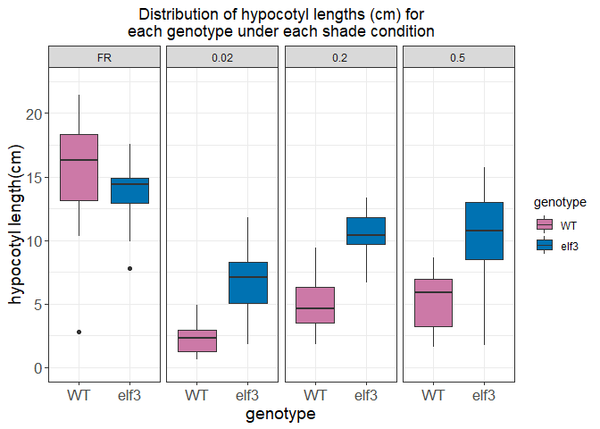
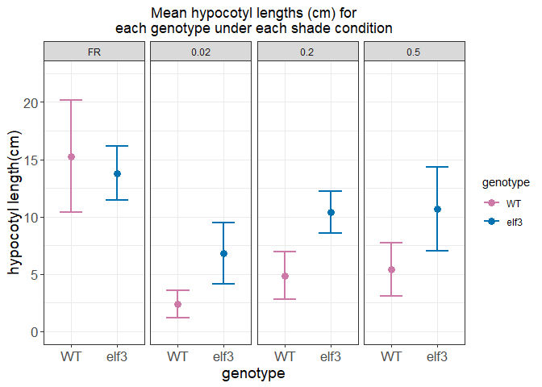
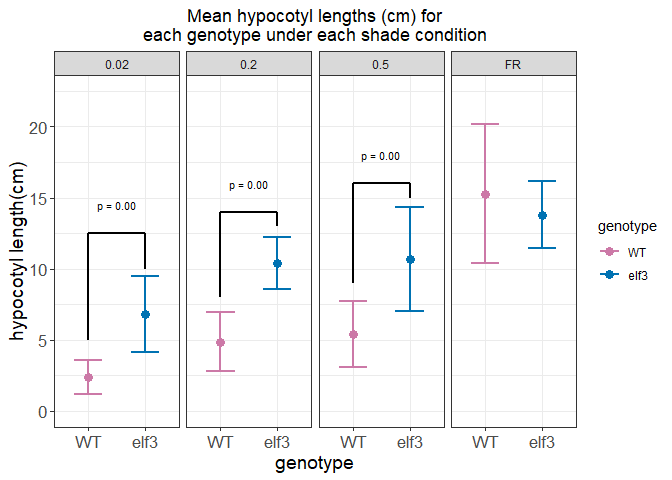
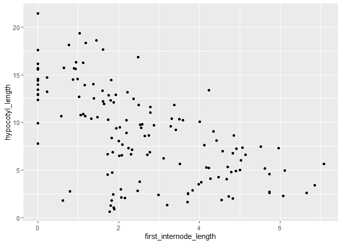
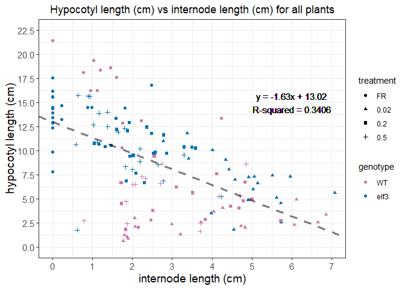

Load libraries, then dataset: 

```r
library(tidyverse)
```

```
## Warning: package 'tidyverse' was built under R version 3.5.3
```

```
## -- Attaching packages ------------------------------------------- tidyverse 1.3.0 --
```

```
## v ggplot2 3.3.0     v purrr   0.3.4
## v tibble  3.0.1     v dplyr   0.8.5
## v tidyr   1.0.2     v stringr 1.4.0
## v readr   1.3.1     v forcats 0.4.0
```

```
## Warning: package 'ggplot2' was built under R version 3.5.3
```

```
## Warning: package 'tibble' was built under R version 3.5.3
```

```
## Warning: package 'tidyr' was built under R version 3.5.3
```

```
## Warning: package 'readr' was built under R version 3.5.3
```

```
## Warning: package 'purrr' was built under R version 3.5.3
```

```
## Warning: package 'dplyr' was built under R version 3.5.3
```

```
## Warning: package 'stringr' was built under R version 3.5.3
```

```
## Warning: package 'forcats' was built under R version 3.5.3
```

```
## -- Conflicts ---------------------------------------------- tidyverse_conflicts() --
## x dplyr::filter() masks stats::filter()
## x dplyr::lag()    masks stats::lag()
```

```r
data1 <- read_csv("hypocotyl_elongation_data_rclub.csv")
```

```
## Warning: Missing column names filled in: 'X12' [12]
```

```
## Parsed with column specification:
## cols(
##   number = col_double(),
##   genotype = col_character(),
##   treatment = col_character(),
##   DAG = col_double(),
##   hypocotyl_length = col_double(),
##   hypcotyl_pixels = col_double(),
##   cm_pixels = col_double(),
##   first_internode_length = col_double(),
##   first_internode_pixels = col_double(),
##   germination_notes = col_character(),
##   `image used` = col_character(),
##   X12 = col_logical()
## )
```


```r
summary(data1)
```

```
##      number         genotype          treatment              DAG    
##  Min.   :  1.00   Length:196         Length:196         Min.   :10  
##  1st Qu.: 37.75   Class :character   Class :character   1st Qu.:10  
##  Median : 74.50   Mode  :character   Mode  :character   Median :10  
##  Mean   : 74.50                                         Mean   :10  
##  3rd Qu.:111.25                                         3rd Qu.:10  
##  Max.   :148.00                                         Max.   :10  
##  NA's   :48                                             NA's   :48  
##  hypocotyl_length  hypcotyl_pixels     cm_pixels     first_internode_length
##  Min.   : 0.2836   Min.   :  55.59   Min.   :128.0   Min.   :0.000         
##  1st Qu.: 4.0723   1st Qu.: 805.22   1st Qu.:172.0   1st Qu.:1.123         
##  Median : 8.0600   Median :1587.22   Median :187.5   Median :2.082         
##  Mean   : 8.3922   Mean   :1520.82   Mean   :189.8   Mean   :2.481         
##  3rd Qu.:12.3922   3rd Qu.:2236.67   3rd Qu.:208.3   3rd Qu.:3.868         
##  Max.   :21.4196   Max.   :3180.85   Max.   :246.1   Max.   :7.084         
##  NA's   :48        NA's   :48        NA's   :48      NA's   :48            
##  first_internode_pixels germination_notes   image used          X12         
##  Min.   :   0.0         Length:196         Length:196         Mode:logical  
##  1st Qu.: 193.5         Class :character   Class :character   NA's:196      
##  Median : 429.0         Mode  :character   Mode  :character                 
##  Mean   : 474.0                                                             
##  3rd Qu.: 706.8                                                             
##  Max.   :1353.0                                                             
##  NA's   :48
```
OK, we have some tidying and re-parsing to do. First, let's check out our NA's: 

```r
filter(data1, is.na(number) == T)
```

```
## # A tibble: 48 x 12
##    number genotype treatment   DAG hypocotyl_length hypcotyl_pixels cm_pixels
##     <dbl> <chr>    <chr>     <dbl>            <dbl>           <dbl>     <dbl>
##  1     NA <NA>     <NA>         NA               NA              NA        NA
##  2     NA <NA>     <NA>         NA               NA              NA        NA
##  3     NA <NA>     <NA>         NA               NA              NA        NA
##  4     NA <NA>     <NA>         NA               NA              NA        NA
##  5     NA <NA>     <NA>         NA               NA              NA        NA
##  6     NA <NA>     <NA>         NA               NA              NA        NA
##  7     NA <NA>     <NA>         NA               NA              NA        NA
##  8     NA <NA>     <NA>         NA               NA              NA        NA
##  9     NA <NA>     <NA>         NA               NA              NA        NA
## 10     NA <NA>     <NA>         NA               NA              NA        NA
## # ... with 38 more rows, and 5 more variables: first_internode_length <dbl>,
## #   first_internode_pixels <dbl>, germination_notes <chr>, `image used` <chr>,
## #   X12 <lgl>
```
HAHAHAHA WTF? WHY is the data LIKE this 
Stuff to do: 
1. Remove the empty observations and column  
2. Parse `genotype`, `treatment`, `germination_notes` as factors
3. Remove the "poor_germination" individuals

```r
data1$genotype <- parse_factor(data1$genotype)
data1$treatment <- parse_factor(data1$treatment)
data1$germination_notes <- parse_factor(data1$germination_notes)

data2 <- data1 %>%
  select(!`X12`) %>%
  filter(is.na(number) != T) %>%
  filter(germination_notes == "good")

summary(data2)
```

```
##      number       genotype  treatment      DAG     hypocotyl_length 
##  Min.   :  2.00   WT  :60   FR  :33   Min.   :10   Min.   : 0.6421  
##  1st Qu.: 37.00   elf3:81   0.02:37   1st Qu.:10   1st Qu.: 4.7699  
##  Median : 74.00   NA  : 0   0.2 :37   Median :10   Median : 8.6376  
##  Mean   : 74.52             0.5 :34   Mean   :10   Mean   : 8.7702  
##  3rd Qu.:111.00             NA  : 0   3rd Qu.:10   3rd Qu.:12.4975  
##  Max.   :148.00                       Max.   :10   Max.   :21.4196  
##  hypcotyl_pixels    cm_pixels     first_internode_length first_internode_pixels
##  Min.   : 130.5   Min.   :128.0   Min.   :0.000          Min.   :   0.0        
##  1st Qu.: 892.0   1st Qu.:171.0   1st Qu.:1.374          1st Qu.: 256.3        
##  Median :1633.8   Median :187.0   Median :2.197          Median : 443.3        
##  Mean   :1588.2   Mean   :189.0   Mean   :2.604          Mean   : 497.5        
##  3rd Qu.:2254.8   3rd Qu.:207.0   3rd Qu.:4.007          3rd Qu.: 748.9        
##  Max.   :3180.8   Max.   :246.1   Max.   :7.084          Max.   :1353.0        
##         germination_notes  image used       
##  poor_germination:  0     Length:141        
##  good            :141     Class :character  
##  NA              :  0     Mode  :character  
##                                             
##                                             
## 
```

```r
head(data2)
```

```
## # A tibble: 6 x 11
##   number genotype treatment   DAG hypocotyl_length hypcotyl_pixels cm_pixels
##    <dbl> <fct>    <fct>     <dbl>            <dbl>           <dbl>     <dbl>
## 1      2 WT       FR           10            13.4            2358.      176.
## 2      3 WT       FR           10            21.4            2956.      138.
## 3      4 WT       FR           10            18.4            2534.      138.
## 4      5 WT       FR           10            19.4            3181.      164.
## 5      6 WT       FR           10             2.80            460.      164.
## 6      7 WT       FR           10            18.1            2915.      161 
## # ... with 4 more variables: first_internode_length <dbl>,
## #   first_internode_pixels <dbl>, germination_notes <fct>, `image used` <chr>
```
OK, looks pretty clean. Now let's plot hypocotyl length. Let's make a boxplot first. We should facet by the types of light intensities. We should also get some colors going for our genotypes. 

```r
colors <- c("WT" = "#CC79A7", "elf3" = "#0072B2")
```

```r
ggplot(data2, aes(genotype, hypocotyl_length)) + 
  geom_boxplot(aes(fill = genotype)) + 
  facet_wrap(~ treatment, nrow = 1) +
  theme_bw() +
  scale_fill_manual(values = colors) +
  coord_cartesian(ylim = c(0, 22.5)) +
  scale_y_continuous(breaks = seq(from = 0, to = 25, by = 5)) + 
  labs(title = "Distribution of hypocotyl lengths (cm) for\neach genotype under each shade condition", 
       x = "genotype", 
       y = "hypocotyl length(cm)", 
       color = "genotype") + 
  theme(plot.title = element_text(hjust = 0.5), 
        axis.title = element_text(size = 14),
        axis.text = element_text(size = 12.5))
```

<!-- -->
OK, means now. We shoudl use our handy-dandy `RMisc`. 

```r
library(Rmisc)
```

```
## Warning: package 'Rmisc' was built under R version 3.5.3
```

```
## Loading required package: lattice
```

```
## Loading required package: plyr
```

```
## ------------------------------------------------------------------------------
```

```
## You have loaded plyr after dplyr - this is likely to cause problems.
## If you need functions from both plyr and dplyr, please load plyr first, then dplyr:
## library(plyr); library(dplyr)
```

```
## ------------------------------------------------------------------------------
```

```
## 
## Attaching package: 'plyr'
```

```
## The following objects are masked from 'package:dplyr':
## 
##     arrange, count, desc, failwith, id, mutate, rename, summarise,
##     summarize
```

```
## The following object is masked from 'package:purrr':
## 
##     compact
```

```r
library(tidyverse)
```


```r
means <- summarySE(data = data2, measurevar = "hypocotyl_length", groupvars = c("treatment", "genotype"))
means
```

```
##   treatment genotype  N hypocotyl_length       sd        se        ci
## 1        FR       WT 13        15.274694 4.872684 1.3514393 2.9445333
## 2        FR     elf3 20        13.800784 2.341419 0.5235571 1.0958176
## 3      0.02       WT 17         2.375029 1.180778 0.2863808 0.6071001
## 4      0.02     elf3 20         6.810449 2.655821 0.5938597 1.2429627
## 5       0.2       WT 16         4.872269 2.098994 0.5247484 1.1184748
## 6       0.2     elf3 21        10.396503 1.817371 0.3965828 0.8272572
## 7       0.5       WT 14         5.415728 2.328937 0.6224346 1.3446881
## 8       0.5     elf3 20        10.666015 3.653374 0.8169192 1.7098316
```

Now we can plot: 

```r
ggplot(means, aes(genotype, hypocotyl_length)) + 
  geom_point(aes(color = genotype), size = 3) + 
  geom_errorbar(aes(ymin = hypocotyl_length - sd, ymax = hypocotyl_length + sd, color = genotype), width = 0.5, size = 1) +
  facet_wrap(~ treatment, nrow = 1) +
  theme_bw() +
  scale_color_manual(values = colors) +
  coord_cartesian(ylim = c(0, 22.5)) +
  scale_y_continuous(breaks = seq(from = 0, to = 25, by = 5)) + 
  labs(title = "Mean hypocotyl lengths (cm) for\neach genotype under each shade condition", 
       x = "genotype", 
       y = "hypocotyl length(cm)", 
       color = "genotype") + 
  theme(plot.title = element_text(hjust = 0.5), 
        axis.title = element_text(size = 14),
        axis.text = element_text(size = 12.5))
```

<!-- -->
Are these means significantly different? I could do this with a for loop but I am too lazy. Let's just do the command. 

```r
data_FR <- data2 %>%
  filter(treatment == "FR") %>%
  select(genotype, hypocotyl_length)

data_0.02 <- data2 %>%
  filter(treatment == "0.02") %>%
  select(genotype, hypocotyl_length)

data_0.2 <- data2 %>%
  filter(treatment == "0.2") %>%
  select(genotype, hypocotyl_length)

data_0.5 <- data2 %>%
  filter(treatment == "0.5") %>%
  select(genotype, hypocotyl_length)

summary(data_FR)
```

```
##  genotype  hypocotyl_length
##  WT  :13   Min.   : 2.804  
##  elf3:20   1st Qu.:12.921  
##  NA  : 0   Median :14.476  
##            Mean   :14.381  
##            3rd Qu.:16.285  
##            Max.   :21.420
```

```r
summary(data_0.02)
```

```
##  genotype  hypocotyl_length 
##  WT  :17   Min.   : 0.6421  
##  elf3:20   1st Qu.: 2.2842  
##  NA  : 0   Median : 4.0847  
##            Mean   : 4.7726  
##            3rd Qu.: 7.2296  
##            Max.   :11.8055
```

```r
summary(data_0.2)
```

```
##  genotype  hypocotyl_length
##  WT  :16   Min.   : 1.815  
##  elf3:21   1st Qu.: 4.985  
##  NA  : 0   Median : 9.395  
##            Mean   : 8.008  
##            3rd Qu.:10.407  
##            Max.   :13.338
```

```r
summary(data_0.5)
```

```
##  genotype  hypocotyl_length
##  WT  :14   Min.   : 1.642  
##  elf3:20   1st Qu.: 5.601  
##  NA  : 0   Median : 8.448  
##            Mean   : 8.504  
##            3rd Qu.:11.655  
##            Max.   :15.724
```

OK, now let's do a t-test for difference in means: 

```r
(FR_t_test <- t.test(data_FR$hypocotyl_length ~ data_FR$genotype, mu = 0,
                    alternative = "two.sided") )
```

```
## 
## 	Welch Two Sample t-test
## 
## data:  data_FR$hypocotyl_length by data_FR$genotype
## t = 1.017, df = 15.65, p-value = 0.3246
## alternative hypothesis: true difference in means is not equal to 0
## 95 percent confidence interval:
##  -1.604089  4.551910
## sample estimates:
##   mean in group WT mean in group elf3 
##           15.27469           13.80078
```

```r
('0.02_t_test' <- t.test(data_0.02$hypocotyl_length ~ data_0.02$genotype, mu = 0,
                    alternative = "two.sided") )
```

```
## 
## 	Welch Two Sample t-test
## 
## data:  data_0.02$hypocotyl_length by data_0.02$genotype
## t = -6.7274, df = 27.123, p-value = 3.116e-07
## alternative hypothesis: true difference in means is not equal to 0
## 95 percent confidence interval:
##  -5.787916 -3.082923
## sample estimates:
##   mean in group WT mean in group elf3 
##           2.375029           6.810449
```

```r
('0.2_t_test' <- t.test(data_0.2$hypocotyl_length ~ data_0.2$genotype, mu = 0,
                    alternative = "two.sided") )
```

```
## 
## 	Welch Two Sample t-test
## 
## data:  data_0.2$hypocotyl_length by data_0.2$genotype
## t = -8.3986, df = 29.75, p-value = 2.41e-09
## alternative hypothesis: true difference in means is not equal to 0
## 95 percent confidence interval:
##  -6.868018 -4.180449
## sample estimates:
##   mean in group WT mean in group elf3 
##           4.872269          10.396503
```

```r
('0.5_t_test' <- t.test(data_0.5$hypocotyl_length ~ data_0.5$genotype, mu = 0,
                    alternative = "two.sided") )
```

```
## 
## 	Welch Two Sample t-test
## 
## data:  data_0.5$hypocotyl_length by data_0.5$genotype
## t = -5.1121, df = 31.8, p-value = 1.458e-05
## alternative hypothesis: true difference in means is not equal to 0
## 95 percent confidence interval:
##  -7.342786 -3.157788
## sample estimates:
##   mean in group WT mean in group elf3 
##           5.415728          10.666015
```

Alrighty kiddos, hold on to your hats. 

```r
base <- tibble(treatment = c("0.02", "0.2", "0.5"))
base
```

```
## # A tibble: 3 x 1
##   treatment
##   <chr>    
## 1 0.02     
## 2 0.2      
## 3 0.5
```

```r
lefties <- tibble("x" = c(1, 1, 1 ), 
                  "xend" = c(1, 1, 1),
                  "y" = c(5, 8, 9), 
                  "yend" = c(12.5, 14, 16))
centies <- tibble("x" = c(1, 1, 1), 
                  "xend" = c(2, 2, 2), 
                  "y" = c(12.5, 14, 16), 
                  "yend" = c(12.5, 14, 16))

righties <- tibble("x" = c(2, 2, 2), 
                   "xend" = c(2, 2, 2), 
                   "y" = c(12.5, 14, 16), 
                   "yend" = c(10, 13, 15))

texties <- tibble("x" = c(1.5, 1.5, 1.5),
                  "y" = c(14.5, 16, 18), 
                  label = c("p = 0.00", "p = 0.00", "p = 0.00"))

left_line <- base %>%
  bind_cols(lefties)

center_line <- base %>%
  bind_cols(centies)

right_line <- base %>%
  bind_cols(righties)

text_coord <- base %>%
  bind_cols(texties)
```

Now for the magic: 

```r
ggplot(means, aes(genotype, hypocotyl_length)) + 
  geom_point(aes(color = genotype), size = 3) + 
  geom_errorbar(aes(ymin = hypocotyl_length - sd, ymax = hypocotyl_length + sd, color = genotype), width = 0.5, size = 1) +
  facet_wrap(~ treatment, nrow = 1) +
  theme_bw() +
  scale_color_manual(values = colors) +
  coord_cartesian(ylim = c(0, 22.5)) +
  scale_y_continuous(breaks = seq(from = 0, to = 25, by = 5)) + 
  labs(title = "Mean hypocotyl lengths (cm) for\neach genotype under each shade condition", 
       x = "genotype", 
       y = "hypocotyl length(cm)", 
       color = "genotype") + 
  theme(plot.title = element_text(hjust = 0.5), 
        axis.title = element_text(size = 14),
        axis.text = element_text(size = 12.5)) + 
  geom_segment(data = left_line, mapping = aes(x = x, xend = xend, y = y, yend = yend), size = 1) +
  geom_segment(data = center_line, mapping = aes(x = x, xend = xend, y = y, yend = yend), size = 1) + 
  geom_segment(data = right_line, mapping = aes(x = x, xend = xend, y = y, yend = yend), size = 1)  +
  geom_text(data = text_coord, mapping = aes(x = x, y = y, label = label), size = 3, color = "black")
```

<!-- -->
**LETS GO**
Interestingly, we could have also investigated this information using ANOVA. Say, for example, we were interested in finding out whether the mean hypocotyl length was the same for WT plants under all conditions. We could perform the following analysis: 

```r
WT_data2 <- filter(data2, genotype == "WT")
summary(WT_data2$genotype)
```

```
##   WT elf3 <NA> 
##   60    0    0
```

```r
summary(WT_data2$treatment)
```

```
##   FR 0.02  0.2  0.5 <NA> 
##   13   17   16   14    0
```
OK, let's run our ANOVA. 
H0: Mean hypocotyl length the same for each treatment of WT plants. 

```r
ANOVA1 <- aov(WT_data2$hypocotyl_length ~ WT_data2$treatment)
summary(ANOVA1)
```

```
##                    Df Sum Sq Mean Sq F value Pr(>F)    
## WT_data2$treatment  3 1348.9   449.6   56.73 <2e-16 ***
## Residuals          56  443.8     7.9                   
## ---
## Signif. codes:  0 '***' 0.001 '**' 0.01 '*' 0.05 '.' 0.1 ' ' 1
```

Obviously, at least one of them is different. But which one could it be? 

```r
TukeyHSD(ANOVA1)
```

```
##   Tukey multiple comparisons of means
##     95% family-wise confidence level
## 
## Fit: aov(formula = WT_data2$hypocotyl_length ~ WT_data2$treatment)
## 
## $`WT_data2$treatment`
##                 diff          lwr        upr     p adj
## 0.02-FR  -12.8996650 -15.64613294 -10.153197 0.0000000
## 0.2-FR   -10.4024252 -13.18583641  -7.619014 0.0000000
## 0.5-FR    -9.8589657 -12.73011800  -6.987813 0.0000000
## 0.2-0.02   2.4972398  -0.09922568   5.093705 0.0635819
## 0.5-0.02   3.0406993   0.35038881   5.731010 0.0208013
## 0.5-0.2    0.5434595  -2.18455489   3.271474 0.9520668
```

Looks like FR is the major outlier here. 

OK, now let's examine the relationship between hypocotyl length and first internode length. 

```r
ggplot(data2, aes(first_internode_length, hypocotyl_length)) + 
  geom_point()
```

<!-- -->

Weird. Why are some of the internode lengths 0? 

```r
filter(data2, first_internode_pixels == 0)
```

```
## # A tibble: 14 x 11
##    number genotype treatment   DAG hypocotyl_length hypcotyl_pixels cm_pixels
##     <dbl> <fct>    <fct>     <dbl>            <dbl>           <dbl>     <dbl>
##  1      3 WT       FR           10            21.4            2956.      138.
##  2     16 elf3     FR           10            14.5            1860.      128.
##  3     17 elf3     FR           10            12.9            1654.      128.
##  4     18 elf3     FR           10            13.9            2078.      149.
##  5     19 elf3     FR           10            17.6            2623.      149.
##  6     23 elf3     FR           10            12.9            2098.      163.
##  7     26 elf3     FR           10             9.89           1702.      172.
##  8     27 elf3     FR           10            12.4            2054.      166 
##  9     28 elf3     FR           10            15.6            2582.      166 
## 10     29 elf3     FR           10            15.6            2597.      166 
## 11     30 elf3     FR           10            16.2            2490.      154 
## 12     31 elf3     FR           10             7.79           1200.      154 
## 13     33 elf3     FR           10            13.4            2609.      194.
## 14     34 elf3     FR           10            14.4            2790.      194.
## # ... with 4 more variables: first_internode_length <dbl>,
## #   first_internode_pixels <dbl>, germination_notes <fct>, `image used` <chr>
```

OK, I don't know enough about this to know if its an error. There are only a handful of these so hopefully they won't mess up the data TOO much. 
We would like to perform a linear regression analysis on the relationship between hypocotyl length and first internode length, so let's take it away. 

```r
hypocotyl_regression <- lm(hypocotyl_length ~ first_internode_length, data = data2)
summary(hypocotyl_regression)
```

```
## 
## Call:
## lm(formula = hypocotyl_length ~ first_internode_length, data = data2)
## 
## Residuals:
##      Min       1Q   Median       3Q      Max 
## -10.2451  -2.0073   0.4275   2.7620   8.3956 
## 
## Coefficients:
##                        Estimate Std. Error t value Pr(>|t|)    
## (Intercept)             13.0240     0.5992  21.737  < 2e-16 ***
## first_internode_length  -1.6336     0.1908  -8.562 1.86e-14 ***
## ---
## Signif. codes:  0 '***' 0.001 '**' 0.01 '*' 0.05 '.' 0.1 ' ' 1
## 
## Residual standard error: 3.977 on 139 degrees of freedom
## Multiple R-squared:  0.3453,	Adjusted R-squared:  0.3406 
## F-statistic: 73.31 on 1 and 139 DF,  p-value: 1.861e-14
```

Hm, it looks like the relationship may not be particularly strong. We can, however, add this information to our plot: 

```r
ggplot(data2, aes(first_internode_length, hypocotyl_length)) + 
  geom_point(aes(color = genotype, shape = treatment)) + 
  geom_abline(aes(intercept = 13.0240, slope = -1.6336), color = "black", alpha = 0.5, linetype = "dashed", size = 1.3) + 
  geom_text(aes(x = 6, y = 15, label = "y = -1.63x + 13.02\nR-squared = 0.3406")) + 
  theme_bw() + 
  labs(title = "Hypocotyl length (cm) vs internode length (cm) for all plants", 
       x = "internode length (cm)" , 
       y = "hypocotyl length (cm)", 
       color = "genotype") + 
  coord_cartesian(xlim = c(0, 7), ylim = c(0, 22.5)) + 
  scale_x_continuous(breaks = seq(from = 0, to = 7, by = 1)) + 
  scale_y_continuous(breaks = seq(from = 0, to = 22.5, by = 2.5)) + 
  theme(plot.title = element_text(hjust = 0.5), 
        axis.title = element_text(size = 14), 
        axis.text = element_text(size = 11.5)) + 
  scale_color_manual(values = colors)
```

<!-- -->
OK, looks nice!


